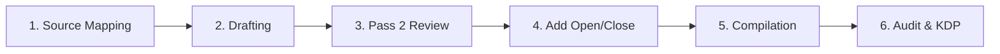

# 🗺️ The Collapse Code (Book 1) — Production Roadmap

This roadmap tracks the processing of *Book 1 (The Collapse Code)*

**What this book is:** Each chapter takes one of Ibn Khaldun's big ideas and applies it to a real historical empire — then connects it to today. Fast, punchy, fun to read. Ibn Khaldun is the credibility and framework; the case studies bring it alive.
**Commercial target:** ~40,000 words / ~160 pages / ~3hr read / $9.99 ebook / $14.99 paperback
**Working Title:** *The Collapse Code*
**Subtitle:** *Ibn Khaldun's 650-Year-Old Formula for Why Civilizations Fall — and What Comes Next*

---

## ⚙️ The 6-Stage eBook Production Pipeline

---

### Stage 1: Source Mapping and Concept Definition
- **Action**: Outline the core ideas from Ibn Khaldun and align them with chapter topics.
- **Status**: `[x]` Complete.

### Stage 2: Drafting
- **Action**: Draft all 7 chapters plus introduction (Pass 1).
- **Status**: `[x]` Complete.

### Stage 3: Pass 2 Review (Deep Pass)
- **Action**: Expand each chapter to ~5,000 words. Deepen historical case studies and references.
- **Status**: `[x]` Complete.

### Stage 4: Add Opening and Closing Pages
- **Action**: Add Reader's Guide, Copyright, and Introduction.
- **Current Files**:
  - `drafts/00_introduction.md` (Introduction and Hook)
  - `drafts/08_readers_guide.md` (Reader's Guide and Further Reading)
  - `drafts/09_copyright.md` (Standard Copyright Page)
- **Status**: `[x]` Complete.

### Stage 5: E-book Compilation
- **Action**: Utilize EPUB infrastructure (`make_epub.py`) to build the ebook.
- **Status**: `[ ]` Pending rebuild.

### Stage 6: Audit & KDP
- **Action**: Final validation in Calibre, Kindle Previewer, and KDP upload (metadata, pricing, etc).
- **Status**: `[ ]` Pending.

---