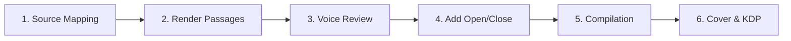

# 🗺️ The Muqaddimah: Greatest Hits (Book 2) — Production Roadmap

This roadmap tracks the processing of *Book 2 (Greatest Hits)*, 

**What this book is:** 14 key passages from the Author's Introduction, Book Two, and Book Three of *The Muqaddimah*, rendered in plain modern English.
**Target:** ~15,000–20,000 words / ~60–80 pages / ~90 min read / $5.99 ebook
**Working Title:** *The Muqaddimah: Essential Passages in Plain English*
**Subtitle:** *The Ideas That Made It the Most Important Book You've Never Read*

---

## ⚙️ The 6-Stage eBook Production Pipeline

---

### Stage 1: Source Mapping (Ingestion)
- **Action**: Match the 14 passage slots to source sections in the extracted `.txt` files built from the original Arabic OCR dump.
- **Status**: `[x]` Complete.

### Stage 2: Render Passages
- **Action**: Render each passage in plain modern English. Introduce Arabic terms once, then use them consistently. 
- **Status**: `[x]` Complete. (14 `.md` files created, passages 1-14).

### Stage 3: Voice Review
- **Action**: Read all passages end-to-end. Check voice consistency across passages, verify accuracy against source intent.
- **Status**: `[x]` Complete.

### Stage 4: Add Opening and Closing Pages
- **Action**: Write the Editor's Note, About the Source, and Copyright page (with cross-promotion to Book 1).
- **Current Files**:
  - `00_editors_note.md` (Editor's Note framing the translation)
  - `15_about_the_source.md` (About the Source context)
  - `16_copyright.md` (Copyright with cross-promotion)
- **Status**: `[x]` Complete.

### Stage 5: E-book Compilation
- **Action**: Compile the segmented chapters into standard e-reader formats utilizing `make_epub_greatest_hits.py`.
- **Status**: `[ ]` Pending rebuild after Stage 4 additions.

### Stage 6: Cover Design & KDP Upload
- **Action**: Design a cover image at KDP spec. Upload EPUB and cover to KDP. Set metadata, pricing, and categories.
- **Status**: `[ ]` Pending.

---
