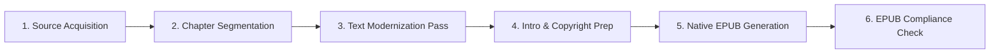

# 📚 The Art of War — eBook Production Roadmap

**Author**: Sun Tzu  
**Edition**: Modernized English Edition (`art_of_war_en.epub`)  
**Directory**: `d:\git_repo\TKprof_book\books\art_of_war\`

---

## ⚙️ eBook Pipeline

---

## 📋 Chapter Plan (13 Classical Chapters)

- [ ] `ch_01_en.txt`: Laying Plans (계획 / 始計)
- [ ] `ch_02_en.txt`: Waging War (작전 / 作戰)
- [ ] `ch_03_en.txt`: Attack by Stratagem (모공 / 謀攻)
- [ ] `ch_04_en.txt`: Tactical Dispositions (군형 / 軍形)
- [ ] `ch_05_en.txt`: Energy (병세 / 兵勢)
- [ ] `ch_06_en.txt`: Weak Points and Strong (허실 / 虛實)
- [ ] `ch_07_en.txt`: Maneuvering (군쟁 / 軍爭)
- [ ] `ch_08_en.txt`: Variation in Tactics (구변 / 九變)
- [ ] `ch_09_en.txt`: The Army on the March (행군 / 行軍)
- [ ] `ch_10_en.txt`: Terrain (지형 / 地形)
- [ ] `ch_11_en.txt`: The Nine Situations (구지 / 九地)
- [ ] `ch_12_en.txt`: The Attack by Fire (화공 / 火攻)
- [ ] `ch_13_en.txt`: The Use of Spies (용간 / 用間)

---

## 🏃 Progress Tracker

| Stage | Task | Status |
| :--- | :--- | :--- |
| **Stage 1** | Directory Setup & Document Framing | ✅ Complete |
| **Stage 2** | Raw Source Text Acquisition | ⬜ Pending |
| **Stage 3** | Text Modernization & Quotation Marking | ⬜ Pending |
| **Stage 4** | Cover Design & EPUB Packaging | ⬜ Pending |
| **Stage 5** | EPUB Validation & Verification | ⬜ Pending |
