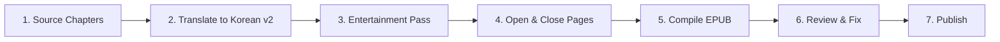

# 🗺️ Beowulf Korean Translation eBook Production Roadmap v2 (The Fun Edition!)

This roadmap guides the production of a revised Korean translation of *Beowulf* (v2), aiming for an incredibly fun, engaging, and modern reading experience, using the existing segmented English chapters as the source.

---

## ⚙️ The eBook Production Pipeline

---

### Stage 1: Source Chapters (Input)
- **Action**: Use the existing segmented English chapter files as the translation source.
- **Input**: `books/beowulf/chapters/` — 44 files (`ch_00_en.txt` through `ch_43_en.txt`).
- **Status**: `[x]` Complete (chapter files already on disk).

---

### Stage 2: Translate to Korean v2
- **Action**: Translate each chapter into highly engaging, modern Korean prose. Make it read like a thrilling fantasy web novel or a cinematic blockbuster!
- **Output**: Korean chapter files saved under `books/beowulf/chapters_kr_v2/` (e.g., `ch_00_ko.txt`, `ch_01_ko.txt`, etc.).
- **Guidelines**:
  * **Fun above all**: Easy understanding and maximum entertainment value are far more important than literal translation.
  * **Modern flair**: Use a modern, punchy Korean style of translation (similar to modern fantasy fiction or web novels). Ditch the stiff, academic, or literary translation style completely.
  * **Pacing and drama**: Emphasize action, tension, and epic moments. Give the monster fights the impact they deserve!
  * Render proper nouns phonetically (e.g., 베오울프, 흐로스가르, 그렌델).
  * Absolutely no archaic Korean (고어) vocabulary. Keep it accessible, fresh, and exciting.
- **Sub-tasks**:
  * `[x]` Prologue (ch_00)
  * `[x]` Chapters 01–10
  * `[x]` Chapters 11–20
  * `[x]` Chapters 21–30
  * `[x]` Chapters 31–43

---

### Stage 3: Entertainment Pass
- **Action**: Review all v2 Korean chapters to ensure maximum engagement, naturalness, and excitement.
- **Checklist**:
  * `[x]` Does it sound awesome? (Read it out loud to check the rhythm of the action scenes).
  * `[x]` Consistent proper noun spelling throughout.
  * `[x]` Replace any boring passages with more dynamic phrasing (while keeping the core story intact).
  * `[x]` Ensure sentences flow naturally for a modern Korean audience.

---

### Stage 4: Add Opening and Closing Pages (Korean v2)
- **Action**: Write or adapt front and back matter to match the new fun tone.
- **Sub-tasks**:
  * `[x]` Create `introduction_ko_v2.txt`: A hype-building introduction — pitch the story like the epic blockbuster it is.
  * `[x]` Create `copyright_ko_v2.txt`: Editorial notes and copyright page.

---

### Stage 5: EPUB Compilation
- **Action**: Assemble all v2 Korean chapter files, the new introduction, and copyright page into a clean `.epub` file.
  * Use the native Python EPUB script.
- **Metadata & Tags**:
  * Title: "베오울프: 스펙터클 현대 한국어판" (Beowulf: Spectacular Modern Korean Edition)
  * Author: 작자 미상 (Anonymous)
  * Language: `ko`
  * Description: A thrilling, modern retelling of the greatest epic.
- **Output**: `beowulf_ko_v2.epub`
- **Script**: `make_epub_native_ko_v2.py` (to be created/adapted)
- **Status**: `[ ]` Pending

---

### Stage 6: Review & Fix
- **Action**: Open the EPUB in a reader and verify layout, chapter flow, and the overall fun factor.
- **Status**: `[ ]` Pending

---

### Stage 7: Publish
- **Action**: Upload finalized Korean v2 EPUB to distribution platforms.
- **Status**: `[ ]` Pending
