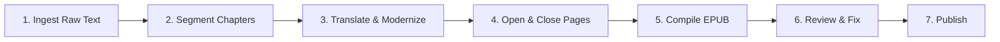

# 🗺️ Beowulf eBook Production Roadmap & Tracker

This roadmap guides the processing of the Old English epic *Beowulf* for modernization, formatting, and automated eBook compilation.

---

## ⚙️ The eBook Production Pipeline

---

### Stage 1: Ingestion (Source Text)
- **Action**: Locate clean, public domain Old English source texts and English translations.
- **Output**: Save raw text file to `books/beowulf/Beowulf_original.txt`.
- **Status**: `[x]` Complete (raw source text downloaded from heorot.dk including both Old English and translation).

---

### Stage 2: Chapter Segmentation
- **Action**: Split the full text into separate fitts (chapters) based on Roman numeral headings.
- **Output**: Chapter files saved under `books/beowulf/chapters/`.
- **Status**: `[x]` Complete (42 fitt files created, including the Prologue).

---

### Stage 3: Translate & Modernize
- **Action**: Convert the Old English poem into a modernized prose narrative (a novel-like story) tailored for a modern audience (middle-school level, ESL-friendly, audiobook-optimized). Standard paragraphs will be used instead of verse.
- Status: `[x]` Complete (Prologue and all 43 Chapters successfully translated to modern prose).
- **Audiobook Modernization Pass**:
  * `[x]` Prologue (Chapter 00) and Chapters 01–05 updated to follow audiobook-friendly guidelines (em-dashes removed, subject-first order, simplified rhythm, simplified kennings like "curved prow" instead of "ring-necked").
  * `[ ]` Chapters 06–43 pending final audiobook flow pass.

---

### Stage 4: Add Opening and Closing Pages
- **Action**: Write an introduction for readers and finalize copyright/feedback closing.
  * `introduction_en.txt`: Plot summary, historical context, note on the origins of the poem and its preservation.
  * `copyright_en.txt`: Editorial notes and legal copyright.
- **Status**: `[x]` Complete.

---

### Stage 5: EPUB Compilation
- **Action**: Assemble all modernized text files (`ch_01_en.txt`, etc.), the introduction, and the copyright page into a clean, well-formatted `.epub` file using the native python EPUB script.
  * Accessibility: Fully optimized for Text-to-Speech (TTS) audiobook engines.
  * Styling: Formatting suited for poetry/epic verse, ensuring the side-by-side translation (if kept) displays elegantly.
- **Metadata & Tags**:
  * Title: "Beowulf: Modern English Edition"
  * Author: Anonymous
  * Description: Full audiobook/ESL-focused pitch description.
  * Subject tags: Epic Poetry, Classic Literature, Old English Literature, Anglo-Saxon, Mythology, ESL EFL Learning, Audiobook Friendly.
- **Output**: `beowulf.epub`
- **Status**: `[ ]` Pending

---

### Stage 6: Review & Fix
- **Action**: Open the EPUB in a reader and verify layout, chapter flow, and styling.
- **Sub-tasks**:
  * `[ ]` Verify verse formatting and line breaks.
  * `[ ]` Ensure TTS compatibility for Old English/Modern English text.
- **Status**: `[ ]` Pending

---

### Stage 7: Publish
- **Action**: Upload finalized EPUB to distribution platforms.
- **Status**: `[ ]` Pending
