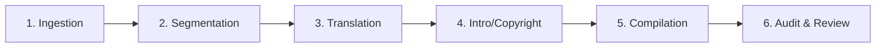

# 🗺️ The Blue Castle (푸른 성) eBook Production & Translation Roadmap

This roadmap tracks the processing of *The Blue Castle* by L.M. Montgomery for Korean translation and automated eBook compilation, following the standardized multi-book production pipeline adapted for the "Romance Fantasy" (로판) web novel market.

---

## ⚙️ The 6-Stage eBook Production Pipeline

---

### Stage 1: Ingestion (Source Text)
- **Action**: Locate clean, public domain English source texts (Project Gutenberg, etc.) and any original illustrations.
- **Output**: Save raw text file to `books/blue_castle/the_blue_castle.txt` and raw HTML to `books/blue_castle/html_version/`.
- **Status**: `[x]` Complete (raw source text, HTML, and images downloaded).

---

### Stage 2: Chapter Segmentation
- **Action**: Split the full text into separate raw chapters stored under `books/blue_castle/chapters/`.
- **Status**: `[x]` Complete (`raw_ch_00.txt` to `raw_ch_45.txt` created).

---

### Stage 3: Translation (Korean Web Novel Style)
- **Action**: Translate the original 1926 prose into engaging, modern Korean targeting the "Romance Fantasy" (로판) web novel audience. Conduct manual quality-checks.
- **Translation Guidelines**:
  * Emphasize the "Web Novel" tropes: Rebellion, Terminal Illness (Fake-out), Contract Romance, and Cozy Escapism.
  * Highlight the "Rebellious Protagonist" (사이다 여주) aspects where Valancy speaks her mind and breaks free from her toxic family.
  * Emphasize the "Cozy Romance" (힐링 로맨스) and "Forest House Living" atmosphere.
- **Status**: `[ ]` Pending.

---

### Stage 4: Add Opening and Closing Pages
- **Action**: Create clean, engaging introduction and closing pages to frame the translated work.
- **Opening Page (`introduction_ko.txt`)**:
  - **TOC Title**: `독자에게 보내는 편지` (A Note to the Reader)
  - **Contents**: Plot themes, L.M. Montgomery's legacy (*Anne of Green Gables*), and an introduction to the "cider-like" refreshing rebellion and cozy romance.
- **Closing Page (`copyright_ko.txt`)**:
  - **TOC Title**: `저작권 및 편집자 노트` (Copyright & About This Edition)
  - **Structure**: (1) Thank You section at top, (2) Review request on platforms like Ridi Books, (3) Editorial notes about the Korean translation approach, (4) Copyright details.
- **Status**: `[ ]` Pending.

---

### Stage 5: E-book Compilation
- **Action**: Compile the segmented chapters and assets into standard e-reader formats (EPUB/HTML).
- **Scripts**: 
  * `make_epub_native.py`: A native Python zip packager that compiles clean, spec-compliant EPUB3 books without dependencies.
- **Status**: `[ ]` Pending.

---

### Stage 6: Review, Validation, & Marketing Optimization
Before publishing, the book must be audited for publisher-specific issues, device compatibility, and SEO:
- **Digital Marketing & SEO**:
  - Ensure listing metadata leverages keywords like "Cozy Romance" (힐링 로맨스), "Rebellious Protagonist" (사이다 여주), and L.M. Montgomery's name for maximum Ridi Books search visibility.
- **XHTML & Metadata Validation**:
  - `dc:date` formatted in ISO-8601.
  - Book ID generated as a unique UUID (`urn:uuid:...`).
  - Dynamic UTC modification date (`dcterms:modified`) added.
  - Descriptive `dc:description` added (using the marketing copy).
- **Layout & Structure**:
  - Promoted pseudo-headers in Intro and Copyright pages to semantic `<h2>` tags.
- **Image Optimization**:
  - Compress any illustrations to JPEG (80% quality), keeping EPUB size under the publishing limits.
- **Audiobook & TTS Compatibility**:
  - Shorten `<title>` tags in XHTML heads to prevent screen-readers and TTS engines from repeating subtitles twice.
- **Status**: `[ ]` Pending.
