# 📚 Dracula — eBook Production Roadmap

**Author**: Bram Stoker  
**Edition**: Modernized English Edition (`dracula_en.epub`)  
**Directory**: `d:\git_repo\TKprof_book\books\dracula\`

---

## ⚙️ eBook Pipeline

```mermaid
flowchart LR
    Source[1. Source Acquisition] --> Segment[2. Chapter Segmentation]
    Segment --> Modernize[3. Text Modernization Pass]
    Modernize --> TransKO[4. Translate to Korean]
    TransKO --> TransBackEN[5. Back-Translate to English]
    TransBackEN --> IntroClose[6. Intro & Copyright Prep]
    IntroClose --> EPUBGen[7. Native EPUB Generation]
    EPUBGen --> Audit[8. EPUB Compliance Check]
```

> [!NOTE]
> **Translation Process**: The text undergoes 2 full translation passes (English ➔ Korean translation, followed by a back-translation to English) using high-tier `pro` subagents to ensure maximum semantic preservation and modernization accuracy.

---

## 📋 Chapter Plan (27 Chapters)

- [ ] `ch01_en.txt` / `ch01_ko.txt`: CHAPTER I
- [ ] `ch02_en.txt` / `ch02_ko.txt`: CHAPTER II
- [ ] `ch03_en.txt` / `ch03_ko.txt`: CHAPTER III
- [ ] `ch04_en.txt` / `ch04_ko.txt`: CHAPTER IV
- [ ] `ch05_en.txt` / `ch05_ko.txt`: CHAPTER V
- [ ] `ch06_en.txt` / `ch06_ko.txt`: CHAPTER VI
- [ ] `ch07_en.txt` / `ch07_ko.txt`: CHAPTER VII
- [ ] `ch08_en.txt` / `ch08_ko.txt`: CHAPTER VIII
- [ ] `ch09_en.txt` / `ch09_ko.txt`: CHAPTER IX
- [ ] `ch10_en.txt` / `ch10_ko.txt`: CHAPTER X
- [ ] `ch11_en.txt` / `ch11_ko.txt`: CHAPTER XI
- [ ] `ch12_en.txt` / `ch12_ko.txt`: CHAPTER XII
- [ ] `ch13_en.txt` / `ch13_ko.txt`: CHAPTER XIII
- [ ] `ch14_en.txt` / `ch14_ko.txt`: CHAPTER XIV
- [ ] `ch15_en.txt` / `ch15_ko.txt`: CHAPTER XV
- [ ] `ch16_en.txt` / `ch16_ko.txt`: CHAPTER XVI
- [ ] `ch17_en.txt` / `ch17_ko.txt`: CHAPTER XVII
- [ ] `ch18_en.txt` / `ch18_ko.txt`: CHAPTER XVIII
- [ ] `ch19_en.txt` / `ch19_ko.txt`: CHAPTER XIX
- [ ] `ch20_en.txt` / `ch20_ko.txt`: CHAPTER XX
- [ ] `ch21_en.txt` / `ch21_ko.txt`: CHAPTER XXI
- [ ] `ch22_en.txt` / `ch22_ko.txt`: CHAPTER XXII
- [ ] `ch23_en.txt` / `ch23_ko.txt`: CHAPTER XXIII
- [ ] `ch24_en.txt` / `ch24_ko.txt`: CHAPTER XXIV
- [ ] `ch25_en.txt` / `ch25_ko.txt`: CHAPTER XXV
- [ ] `ch26_en.txt` / `ch26_ko.txt`: CHAPTER XXVI
- [ ] `ch27_en.txt` / `ch27_ko.txt`: CHAPTER XXVII

---

## 🏃 Progress Tracker

| Stage | Task | Status |
| :--- | :--- | :--- |
| **Stage 1** | Directory Setup & Document Framing | ✅ Complete |
| **Stage 2** | Raw Source Text Acquisition & Split | ✅ Complete |
| **Stage 3** | Text Modernization & Dialogue Clean | ⏳ Pending |
| **Stage 4** | Translate English to Korean (using Pro subagents) | ⏳ Pending |
| **Stage 5** | Back-Translate Korean to English (using Pro subagents) | ⏳ Pending |
| **Stage 6** | Cover Design & EPUB Packaging | ⏳ Pending |
| **Stage 7** | EPUB Validation & Verification | ⏳ Pending |

---

## 📊 Production Stats

- **Translation/Refinement Subagent Passes**: 0 runs
- **Translation/Splitting Script Executions**: 1 run
