# 📚 Frankenstein — eBook Production Roadmap

**Author**: Mary Wollstonecraft Shelley  
**Edition**: Modernized English Edition (`frankenstein_en.epub`)  
**Directory**: `d:\git_repo\TKprof_book\books\frankenstein\`

---

## ⚙️ eBook Pipeline

```mermaid
flowchart LR
    Source[1. Source Acquisition] --> Segment[2. Chapter Segmentation]
    Segment --> Modernize[3. Text Modernization Pass]
    Modernize --> TransKO[4. Translate to Korean]
    TransKO --> TransBackEN[5. Back-Translate to English]
    TransBackEN --> IntroClose[6. Intro & Copyright Prep]
    IntroClose --> EPUBGen[7. Native EPUB Generation]
    EPUBGen --> Audit[8. EPUB Compliance Check]
```

> [!NOTE]
> **Translation Process**: The text undergoes 2 full translation passes (English ➔ Korean translation, followed by a back-translation to English) using high-tier `pro` subagents to ensure maximum semantic preservation and modernization accuracy.

---

## 📋 Chapter Plan (28 Sequential Chapters)

- [x] `ch_01_en.txt` / `ch_01_ko.txt`: Letter I
- [x] `ch_02_en.txt` / `ch_02_ko.txt`: Letter II
- [x] `ch_03_en.txt` / `ch_03_ko.txt`: Letter III
- [x] `ch_04_en.txt` / `ch_04_ko.txt`: Letter IV
- [x] `ch_05_en.txt` / `ch_05_ko.txt`: Chapter I
- [x] `ch_06_en.txt` / `ch_06_ko.txt`: Chapter II
- [x] `ch_07_en.txt` / `ch_07_ko.txt`: Chapter III
- [x] `ch_08_en.txt` / `ch_08_ko.txt`: Chapter IV
- [x] `ch_09_en.txt` / `ch_09_ko.txt`: Chapter V
- [x] `ch_10_en.txt` / `ch_10_ko.txt`: Chapter VI
- [x] `ch_11_en.txt` / `ch_11_ko.txt`: Chapter VII
- [x] `ch_12_en.txt` / `ch_12_ko.txt`: Chapter VIII
- [x] `ch_13_en.txt` / `ch_13_ko.txt`: Chapter IX
- [x] `ch_14_en.txt` / `ch_14_ko.txt`: Chapter X
- [x] `ch_15_en.txt` / `ch_15_ko.txt`: Chapter XI
- [x] `ch_16_en.txt` / `ch_16_ko.txt`: Chapter XII
- [x] `ch_17_en.txt` / `ch_17_ko.txt`: Chapter XIII
- [x] `ch_18_en.txt` / `ch_18_ko.txt`: Chapter XIV
- [x] `ch_19_en.txt` / `ch_19_ko.txt`: Chapter XV
- [x] `ch_20_en.txt` / `ch_20_ko.txt`: Chapter XVI
- [x] `ch_21_en.txt` / `ch_21_ko.txt`: Chapter XVII
- [x] `ch_22_en.txt` / `ch_22_ko.txt`: Chapter XVIII
- [x] `ch_23_en.txt` / `ch_23_ko.txt`: Chapter XIX
- [x] `ch_24_en.txt` / `ch_24_ko.txt`: Chapter XX
- [x] `ch_25_en.txt` / `ch_25_ko.txt`: Chapter XXI
- [x] `ch_26_en.txt` / `ch_26_ko.txt`: Chapter XXII
- [x] `ch_27_en.txt` / `ch_27_ko.txt`: Chapter XXIII
- [x] `ch_28_en.txt` / `ch_28_ko.txt`: Chapter XXIV

---

## 🏃 Progress Tracker

| Stage | Task | Status |
| :--- | :--- | :--- |
| **Stage 1** | Directory Setup & Document Framing | ✅ Complete |
| **Stage 2** | Raw Source Text Acquisition & Split | ✅ Complete |
| **Stage 3** | Text Modernization & Dialogue Clean | ✅ Complete |
| **Stage 4** | Translate English to Korean (using Pro subagents) | ✅ Complete |
| **Stage 5** | Back-Translate Korean to English (using Pro subagents) | ✅ Complete |
| **Stage 6** | Cover Design & EPUB Packaging | ✅ Complete |
| **Stage 7** | EPUB Validation & Verification | ✅ Complete |

---

## 📊 Production Stats

- **Translation/Refinement Subagent Passes**: 350 runs
- **Translation/Splitting Script Executions**: 61 runs

