# 📚 Frankenstein — eBook Production Roadmap

**Author**: Mary Wollstonecraft Shelley  
**Edition**: Modernized English Edition (`frankenstein_en.epub`)  
**Directory**: `d:\git_repo\TKprof_book\books\frankenstein\`

---

## ⚙️ eBook Pipeline

```mermaid
flowchart LR
    Source[1. Source Acquisition] --> Segment[2. Chapter Segmentation]
    Segment --> Modernize[3. Text Modernization Pass]
    Modernize --> TransKO[4. Translate to Korean]
    TransKO --> TransBackEN[5. Back-Translate to English]
    TransBackEN --> IntroClose[6. Intro & Copyright Prep]
    IntroClose --> EPUBGen[7. Native EPUB Generation]
    EPUBGen --> Audit[8. EPUB Compliance Check]
```

> [!NOTE]
> **Translation Process**: The text undergoes 2 full translation passes (English ➔ Korean translation, followed by a back-translation to English) using high-tier `pro` subagents to ensure maximum semantic preservation and modernization accuracy.

---

## 📋 Chapter Plan (28 Sequential Chapters)

- [x] `1.Lt1_en.txt` / `1.Lt1_ko.txt`: Letter I
- [x] `2.Lt2_en.txt` / `2.Lt2_ko.txt`: Letter II
- [x] `3.Lt3_en.txt` / `3.Lt3_ko.txt`: Letter III
- [x] `4.Lt4_en.txt` / `4.Lt4_ko.txt`: Letter IV
- [x] `5.ch1_en.txt` / `5.ch1_ko.txt`: Chapter I
- [x] `6.ch2_en.txt` / `6.ch2_ko.txt`: Chapter II
- [x] `7.ch3_en.txt` / `7.ch3_ko.txt`: Chapter III
- [x] `8.ch4_en.txt` / `8.ch4_ko.txt`: Chapter IV
- [x] `9.ch5_en.txt` / `9.ch5_ko.txt`: Chapter V
- [x] `10.ch6_en.txt` / `10.ch6_ko.txt`: Chapter VI
- [x] `11.ch7_en.txt` / `11.ch7_ko.txt`: Chapter VII
- [x] `12.ch8_en.txt` / `12.ch8_ko.txt`: Chapter VIII
- [x] `13.ch9_en.txt` / `13.ch9_ko.txt`: Chapter IX
- [x] `14.ch10_en.txt` / `14.ch10_ko.txt`: Chapter X
- [x] `15.ch11_en.txt` / `15.ch11_ko.txt`: Chapter XI
- [x] `16.ch12_en.txt` / `16.ch12_ko.txt`: Chapter XII
- [x] `17.ch13_en.txt` / `17.ch13_ko.txt`: Chapter XIII
- [x] `18.ch14_en.txt` / `18.ch14_ko.txt`: Chapter XIV
- [x] `19.ch15_en.txt` / `19.ch15_ko.txt`: Chapter XV
- [x] `20.ch16_en.txt` / `20.ch16_ko.txt`: Chapter XVI
- [x] `21.ch17_en.txt` / `21.ch17_ko.txt`: Chapter XVII
- [x] `22.ch18_en.txt` / `22.ch18_ko.txt`: Chapter XVIII
- [x] `23.ch19_en.txt` / `23.ch19_ko.txt`: Chapter XIX
- [x] `24.ch20_en.txt` / `24.ch20_ko.txt`: Chapter XX
- [x] `25.ch21_en.txt` / `25.ch21_ko.txt`: Chapter XXI
- [x] `26.ch22_en.txt` / `26.ch22_ko.txt`: Chapter XXII
- [x] `27.ch23_en.txt` / `27.ch23_ko.txt`: Chapter XXIII
- [x] `28.ch24_en.txt` / `28.ch24_ko.txt`: Chapter XXIV

---

## 🏃 Progress Tracker

| Stage | Task | Status |
| :--- | :--- | :--- |
| **Stage 1** | Directory Setup & Document Framing | ✅ Complete |
| **Stage 2** | Raw Source Text Acquisition & Split | ✅ Complete |
| **Stage 3** | Text Modernization & Dialogue Clean | ✅ Complete |
| **Stage 4** | Translate English to Korean (using Pro subagents) | ✅ Complete |
| **Stage 5** | Back-Translate Korean to English (using Pro subagents) | ✅ Complete |
| **Stage 6** | Cover Design & EPUB Packaging | ✅ Complete |
| **Stage 7** | EPUB Validation & Verification | ✅ Complete |

---

## 📊 Production Stats

- **Translation/Refinement Subagent Passes**: 350 runs
- **Translation/Splitting Script Executions**: 61 runs

