# 📚 Frankenstein — eBook Production Roadmap

**Author**: Mary Wollstonecraft Shelley  
**Edition**: Modernized English Edition (`frankenstein_en.epub`)  
**Directory**: `d:\git_repo\TKprof_book\books\frankenstein\`

---

## ⚙️ eBook Pipeline

```mermaid
flowchart LR
    Source[1. Source Acquisition] --> Segment[2. Chapter Segmentation]
    Segment --> Modernize[3. Text Modernization Pass]
    Modernize --> TransKO[4. Translate to Korean]
    TransKO --> TransBackEN[5. Back-Translate to English]
    TransBackEN --> IntroClose[6. Intro & Copyright Prep]
    IntroClose --> EPUBGen[7. Native EPUB Generation]
    EPUBGen --> Audit[8. EPUB Compliance Check]
```

> [!NOTE]
> **Translation Process**: The text undergoes 2 full translation passes (English ➔ Korean translation, followed by a back-translation to English) using high-tier `pro` subagents to ensure maximum semantic preservation and modernization accuracy.

---

## 📋 Chapter Plan (7 Segmented Parts)

- [ ] `ch_00_en.txt`: Letters I–IV (Captain Walton's Letters & Meeting Victor)
- [ ] `ch_01_en.txt`: Chapters 1–4 (Victor's Youth, Ambition, and the Creation)
- [ ] `ch_02_en.txt`: Chapters 5–8 (The Creature's Escape, Tragedy, and Trial)
- [ ] `ch_03_en.txt`: Chapters 9–12 (Mont Blanc Meeting & Creature's Early Solitary Life)
- [ ] `ch_04_en.txt`: Chapters 13–16 (Observation of the De Laceys & Outcast Vows)
- [ ] `ch_05_en.txt`: Chapters 17–20 (The Demand for a Mate & Victor's Reluctance)
- [ ] `ch_06_en.txt`: Chapters 21–24 (Vengeance, Final Chase to the North Pole, and Farewell)

---

## 🏃 Progress Tracker

| Stage | Task | Status |
| :--- | :--- | :--- |
| **Stage 1** | Directory Setup & Document Framing | ✅ Complete |
| **Stage 2** | Raw Source Text Acquisition & Split | ✅ Complete |
| **Stage 3** | Text Modernization & Dialogue Clean | ✅ Complete |
| **Stage 4** | Translate English to Korean (using Pro subagents) | ✅ Complete |
| **Stage 5** | Back-Translate Korean to English (using Pro subagents) | ✅ Complete |
| **Stage 6** | Cover Design & EPUB Packaging | ✅ Complete |
| **Stage 7** | EPUB Validation & Verification | ✅ Complete |

