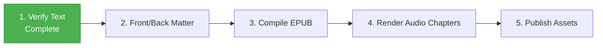

# 🗺️ Gilgamesh Production Roadmap: EPUB to Audiobook

This roadmap tracks the production of the English edition of the *Epic of Gilgamesh*. Originally formatted as a podcast, the text is now being consolidated into a formal eBook structure (Phase 1) and will subsequently be converted into a fully produced Audiobook (Phase 2).

---

## ⚙️ The Production Pipeline

---

### Stage 1: Text Verification (Completed)
- **Action**: Ensure `chapters/ch_01_en.txt` to `ch_06_en.txt` contain clean narrative prose (without podcast intros/outros).
- **Status**: `[x]` Complete.

### Stage 2: Front & Back Matter
- **Action**: Create contextual introductions and copyright notices for the eBook.
  * `introduction_en.txt`: Plot summary, historical context.
  * `copyright_en.txt`: Public domain declarations and copyright for this adaptation.
- **Status**: `[x]` Complete.

### Stage 3: EPUB Compilation (Phase 1 Goal)
- **Action**: Assemble all text files (`ch_01_en.txt` to `ch_06_en.txt`, plus intro and copyright) into a well-formatted `.epub` file using `make_epub_native.py`.
- **Metadata & Tags**:
  * Title: "The Epic of Gilgamesh"
  * Author: Anonymous
  * Description: A modernized English adaptation of the ancient Mesopotamian epic.
  * Subject tags: Epic Poetry, Classic Literature, Mythology, Ancient Near East.
- **Output**: `gilgamesh_en.epub`
- **Status**: `[ ]` In Progress

### Stage 4: Audiobook Rendering (Phase 2 Goal)
- **Action**: Map character voices (using local Kokoro models) to the finalized text in the EPUB. Render high-quality MP3 chapters using the TKPROF pipeline.
- **Output**: `audio/ch_01_en.mp3` through `ch_06_en.mp3`
- **Status**: `[ ]` Pending

### Stage 5: Final Review & Publishing
- **Action**: Validate EPUB structure (`check_epub.py`), verify audio quality, and package assets for distribution.
- **Status**: `[ ]` Pending
