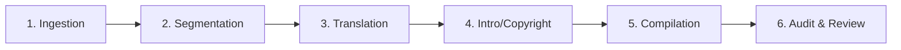

# 🗺️ The Odyssey (오디세이아) eBook Production & Translation Roadmap

This roadmap tracks the processing of Homer's *The Odyssey* (translated by Samuel Butler) for translation/modernization and automated eBook compilation, following the standardized multi-book production pipeline.

---

## ⚙️ The 6-Stage eBook Production Pipeline

---

### Stage 1: Ingestion (Source Text)
- **Action**: Locate clean, public domain English source texts (Project Gutenberg, etc.).
- **Output**: Save raw text file to `books/odyssey/raw_source.txt`.
- **Status**: `[x]` Complete (Samuel Butler's translation downloaded).

---

### Stage 2: Chapter Segmentation
- **Action**: Split the full text into 24 separate raw chapters (Books 1 to 24) stored under `books/odyssey/chapters/`.
- **Status**: `[x]` Complete (`raw_ch_01.txt` to `raw_ch_24.txt` created).

---

### Stage 3: Translation & Modernization (English/Korean)
- **Action**: Adapt original prose into engaging, clear, modern English and/or Korean targeting contemporary readers and TTS listeners.
- **Guidelines**:
  * Emphasize readability, pacing, and flow.
- **Status**: `[x]` Complete for both editions!
  * **Korean Edition**: `ch_01_ko.txt` to `ch_24_ko.txt` created with '제 일장' formatting.
  * **English Edition**: `ch_01_en.txt` to `ch_24_en.txt` created with 'Book 1' formatting.

---

### Stage 4: Add Opening and Closing Pages
- **Action**: Create clean, engaging introduction and closing pages to frame the modernized work.
- **Opening Page (`introduction_ko.txt` / `introduction_en.txt`)**:
  - **TOC Title**: `오디세이아 소개` / `About This Edition`
  - **Contents**: Historical context of Homer's Odyssey, its legacy, and notes on the modernization.
- **Closing Page (`copyright_ko.txt` / `copyright_en.txt`)**:
  - **TOC Title**: `판권 및 본 에디션 소개` / `Copyright & About This Edition`
- **Status**: `[x]` Complete (Korean and English localized metadata files created).

---

### Stage 5: E-book Compilation
- **Action**: Compile the segmented chapters and assets into standard EPUB3 formats using the project's native packaging tool.
- **Status**: `[x]` Complete for both editions!
  * **Korean Edition**: `odyssey_ko.epub` generated with clean metadata, styles, and covers.
  * **English Edition**: `odyssey_en.epub` generated with clean metadata, Playfair Display & Lora typography, and covers.

---

### Stage 6: Review, Validation, & Auditing
Before publishing, the book must be audited:
- **XHTML & Metadata Validation**: Ensure compliance with EPUB3 standards, including dynamic modification dates and UUIDs.
- **TTS and Audio Check**: Check screen-reader friendliness and ensure formatting does not repeat chapter/book titles awkwardly.
- **Status**: `[ ]` Pending.
