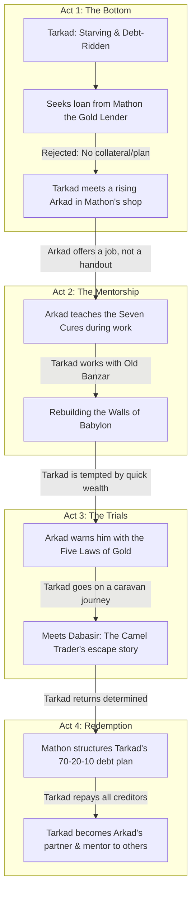

# Linear Story Map: The Richest Man in Babylon (Recreated)

This blueprint reorganizes the original scattered parables into a single, cohesive, and linear narrative. By focusing on a single protagonist (**Tarkad**) and centering the mentorship around a **younger, rising Arkad** (in his 30s/40s) and his associate **Mathon**, we turn a collection of essays into a unified novel of financial redemption.

---

## 🗺️ Reimagined Linear Narrative Arc

Instead of jumping across centuries, the story progresses chronologically through **Tarkad’s journey from a starving debtor to a wealthy merchant**, guided by Arkad and Mathon.

---

## 👥 The Core Cast (Unified Roles)

*   **Tarkad (The Protagonist):** Our POV character. He begins as a desperate, debt-ridden young man. His struggle to survive and pay back his debts forms the spine of the entire book.
*   **Arkad (The Mentor - Age 35-40):** No longer an untouchable old patriarch. He is a successful, highly respected merchant/contractor who still vividly remembers his own struggle as a scribe under Algamish. He takes Tarkad under his wing.
*   **Mathon (The Advisor):** Arkad’s close business associate and the premier gold lender of Babylon. He acts as the analytical counterweight, teaching Tarkad the structural mathematics of debt and the risks of lending.
*   **Dabasir (The Catalyst):** A traveling camel trader met by Tarkad on a trade caravan. Dabasir shares his harrowing story of escaping slavery in Syria to teach Tarkad about willpower.
*   **Banzar (The Builder):** The foreman managing the rebuilding of the city walls where Tarkad is sent to work.

---

## 📖 The Linear Chapter Roadmap

### Act 1: The Lean Purse (Chapters 1 - 3)
*   **Chapter 1: The Golden City of Barefoot Men**
    *   *Plot:* We open on Tarkad, starving in the streets of Babylon, avoiding his creditors. He talks with his childhood friends Bansir (chariot builder) and Kobbi (musician), realizing they are all trapped in a cycle of working hard just to pay for daily bread.
    *   *Linear Shift:* Tarkad decides to seek a loan from the legendary gold lender, Mathon.
*   **Chapter 2: The Scribe's Legacy**
    *   *Plot:* In Mathon’s shop, Tarkad begs for gold. Mathon refuses, stating that lending to a man with no plan is like throwing gold into the Euphrates. Arkad, visiting Mathon to finance a construction project, overhears. Seeing his younger self in Tarkad, Arkad offers him labor and mentorship instead of a handout.
    *   *Linear Shift:* Arkad shares the story of how he, as a young scribe, bought his own financial freedom from the old lender Algamish.
*   **Chapter 3: The Temple of Learning (The Seven Cures)**
    *   *Plot:* King Sargon, returning from war, finds Babylon's economy in ruins because the wealth is concentrated in too few hands. He commissions Arkad to teach the city how to build wealth. Arkad gathers a class of 100 citizens in the Temple of Learning. **Tarkad is selected as one of the 100 students** (sponsored by Mathon to give him a chance).
    *   *Integration:* Tarkad sits in the audience of 100 as Arkad teaches the **Seven Cures for a Lean Purse**. The physical reconstruction of the city walls under foreman Banzar is introduced here as the backdrop—Arkad uses the walls as a metaphor to teach the cure of "ensuring a future income and protection."
    *   *Lesson:* Save 10%, control expenses, and build "walls" of protection for your future.

### Act 2: The Rules of Risk (Chapters 4 - 5)
*   **Chapter 4: The Gold Lender’s Scales**
    *   *Plot:* Having saved his first bag of gold, Tarkad is eager to invest it. He consults Mathon about a "guaranteed" tip on a bronze deal. Mathon uses his scales to explain the rules of risk and tells Tarkad the story of *The Farmer who understood the language of beasts* to warn him against taking on other people's financial burdens.
*   **Chapter 5: The Five Laws of Gold**
    *   *Plot:* To test Tarkad's maturity, Arkad plans to send him on a trade caravan to Damascus. Before leaving, Arkad gives Tarkad a clay tablet outlining the **Five Laws of Gold** (originally passed down to Arkad’s son, Nomasir, who failed before succeeding). Arkad warns Tarkad that if he doesn't respect the laws, the desert will swallow his savings.

### Act 3: The Soul of a Free Man (Chapters 6 - 8)
*   **Chapter 6: The Syrian Trail**
    *   *Plot:* On the caravan route, Tarkad is tempted to procrastinate and join a high-stakes camel-betting ring. A traveling camel trader, **Dabasir**, intervenes and shares his own story: how debt drove him out of Babylon, sold him into slavery in Syria, and how he had to find the "soul of a free man" to escape across the desert on stolen camels.
    *   *Linear Shift:* Dabasir's escape is no longer a random side-story; it is a direct intervention that saves Tarkad from repeating Dabasir's mistakes.
*   **Chapter 7: The Debt Cleansing**
    *   *Plot:* Inspired by Dabasir, Tarkad returns to Babylon. Under Mathon's supervision, Tarkad writes his debts onto clay tablets. He commits to the **70-20-10 rule** (70% for living, 20% to systematically repay all creditors, 10% to save). He visits each creditor personally to promise them repayment.

### Act 4: The Golden Harvest (Chapters 8 - 9)
*   **Chapter 8: The Luckiest Man in Babylon**
    *   *Plot:* Years pass. Tarkad has successfully cleared all his debts and built his own trading business. He is now a wealthy partner of Arkad and Mathon. He takes on a young, spoiled apprentice (Hadan Gula, grandson of Arad Gula) and tells him the final story of how Arad Gula used the honor of work to rise from a slave to a free partner.
*   **Chapter 9: The Legacy of Babylon**
    *   *Plot:* The book ends with Arkad, now an older man, looking over a prosperous Babylon alongside his successful successor, Tarkad. They reflect that a city's wealth is only as strong as the financial wisdom of its poorest citizens.
*   **Epilogue: The Nottingham Letters (The Archaeologist's Letters)**
    *   *Plot:* We fast-forward to the 20th century. A series of letters from an English archaeologist at Nottingham University details the excavation of Tarkad's clay tablets from the ruins of Babylon. He translates Tarkad's debt-repayment journal (the 70-20-10 plan) and writes to his colleague about how he and his wife applied the ancient Babylonian formula to successfully clear their own modern-day credit card and mortgage debts.

---

## 🔗 Original Parable Mapping Reference

Here is how the original parables from George S. Clason's classic are integrated into Tarkad's unified, linear storyline:

| Original Story / Parable | Where it is in the New Linear Story | How it's integrated |
| :--- | :--- | :--- |
| **1. The Man Who Desired Gold** | **Chapter 1** | Tarkad discusses his hunger with Bansir (chariot builder) and Kobbi (musician). |
| **2. The Richest Man in Babylon** | **Chapter 2** | Arkad tells Tarkad his own origin story of working as a scribe for Algamish. |
| **3. Seven Cures for a Lean Purse** | **Chapter 3** | Arkad teaches these 7 lessons to Tarkad and the workers on the Babylon walls. |
| **4. Meet the Goddess of Good Luck** | **Chapter 6** | Framed during the caravan trip, Dabasir warns Tarkad about the procrastination of luck during camel-betting. |
| **5. The Five Laws of Gold** | **Chapter 5** | Arkad gives Tarkad the clay tablet detailing Nomasir's trials. |
| **6. The Gold Lender of Babylon** | **Chapter 4** | Mathon the Gold Lender teaches Tarkad about risk and tells the parable of the Farmer & Ox. |
| **7. The Walls of Babylon** | **Chapter 3** | The physical wall construction led by foreman Banzar serves as the setting for the lesson on financial protection. |
| **8. The Camel Trader of Babylon** | **Chapter 6** | Dabasir tells Tarkad the story of his escape from slavery in Syria. |
| **9. The Clay Tablets from Babylon** | **Epilogue** | The modern letters where the archaeologist translates Tarkad's 70-20-10 plan and tests it. |
| **10. The Luckiest Man in Babylon** | **Chapter 8** | An older Tarkad mentors Hadan Gula by sharing the story of Sharru Nada and Arad Gula. |

