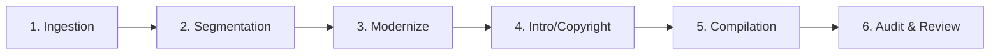

# 🗺️ The Scarlet Letter eBook Production Roadmap & Tracker

This roadmap tracks the processing of *The Scarlet Letter* by Nathaniel Hawthorne for modernization and automated eBook compilation, following the standardized multi-book production pipeline.

---

## ⚙️ The 6-Stage eBook Production Pipeline

---

### Stage 1: Ingestion (Source Text)
- **Action**: Locate clean, public domain English source texts (Project Gutenberg, etc.) and original 1878 illustrations.
- **Output**: Save raw text file to `books/scarlet_letter/raw_source.txt` and raw HTML to `books/scarlet_letter/raw_source.html`.
- **Status**: `[x]` Complete (raw source text, HTML, and all illustrations/plates downloaded).

---

### Stage 2: Chapter Segmentation
- **Action**: Split the full text into separate raw chapters stored under `books/scarlet_letter/chapters/`.
- **Status**: `[x]` Complete (`raw_ch_00.txt` to `raw_ch_24.txt` created).

---

### Stage 3: Modernization
- **Action**: Simplify the original 19th-century Puritan prose to clear, engaging middle-school level modern English style (ideal for ESL/EFL learners and casual readers). Conduct manual quality-checks.
- **Deep Cleanups**:
  * Cleaned up archaic/corrupted paragraphs in `ch_00_en.txt` (removed merged raw/modernized artifacts, simplified Victorian academic vocabulary like "lucubrations", "requisite", etc.).
- **Status**: `[x]` Complete. All 25 chapters modernized and quality-checked (`ch_00_en.txt` to `ch_24_en.txt`). No em-dashes, no double hyphens, no inverted word order.

---

### Stage 4: Add Opening and Closing Pages
- **Action**: Create clean, engaging introduction and closing pages to frame the modernized work.
- **Opening Page (`introduction_en.txt`)**:
  - **TOC Title**: `A Note to the Reader`
  - **Contents**: Plot themes, historical context, target audience details, and explanatory notes regarding placing "The Custom-House" at the back to keep the narrative start engaging.
- **Closing Page (`copyright_en.txt`)**:
  - **TOC Title**: `Copyright & About This Edition`
  - **Structure**: (1) Thank You section at top, (2) Review request, 
    (3) Editorial notes about casual modernization, drop caps, and colorized illustrations, 
       Also lists the word counts:
    - **Original Text**: ~83,800 words
    - **Modernized Text**: ~57,400 words
    (4) Copyright details.
- **Status**: `[x]` Complete.

---

### Stage 5: E-book Compilation
- **Action**: Compile the segmented chapters and assets into standard e-reader formats.
- **Scripts**: 
  * `make_epub_native.py`: A native Python zip packager that compiles clean, spec-compliant EPUB3 books without dependencies.
  * `make_epub.py`: Legacy EpubLib-based builder.
- **Compilation Milestones**:
  * **Split Preface & Custom-House**: Dynamic splitting on `"THE CUSTOM-HOUSE"` inside `ch_00_en.txt` to compile **Preface to the Second Edition** and **The Custom-House** into two distinct XHTML files and TOC/spine entries.
  * **0-Byte XHTML Fix**: Encoded XHTML templates as `bytes` before writing to resolve `lxml` parsing exceptions and prevent zero-size files.
- **Status**: `[x]` Complete. EPUB compiles successfully.

---

### Stage 6: Review, Validation, & Optimization (Publisher Readiness Audit)
Before publishing, the book must be audited for publisher-specific issues and device compatibility:
- **XHTML & Metadata Validation**:
  - `dc:date` formatted in ISO-8601 (`2026-06-22`).
  - Book ID generated as a unique UUID (`urn:uuid:...`).
  - Dynamic UTC modification date (`dcterms:modified`) added.
  - Descriptive `dc:description` added.
  - Corrected XML ampersand escaping (`&amp;`) in copyright titles to fix Google Play Books processing errors.
- **Layout & Structure**:
  - Promoted pseudo-headers in Intro and Copyright pages to semantic `<h2>` tags.
  - Custom-House file references (`ch00` -> `custom_house`) re-anchored for clean spine structure.
- **Image Optimization**:
  - Resized 58 colorized PNG illustrations to a max-dimension of 800px and compressed them to JPEG (80% quality), reducing the final EPUB payload size from **~18.6 MB to ~3.7 MB** (well under the 5 MB publishing limit).
- **Audiobook & TTS Compatibility**:
  - Shortened `<title>` tags in XHTML heads (e.g., `Chapter Twenty-Three`) to prevent screen-readers and TTS engines (like Google Play Books "Read Aloud") from repeating subtitles twice.
- **Status**: `[x]` Complete. All publisher readiness issues resolved. EPUB is verified, validated, and optimized.
