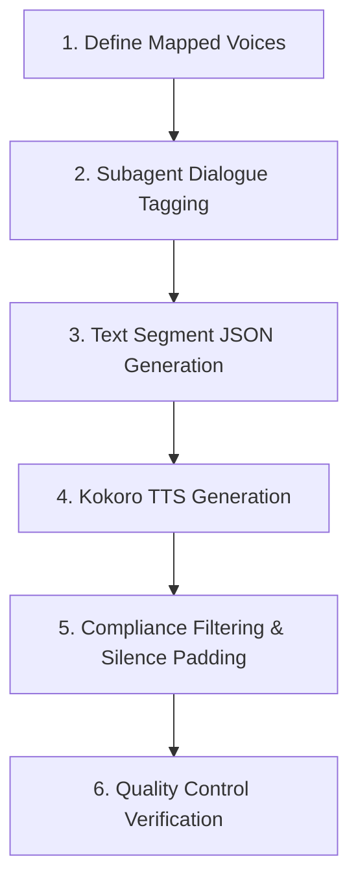

# 🎙️ The Secret Garden (비밀의 화원) — Audiobook Production Roadmap

This roadmap outlines the steps to produce a high-quality, fully compliant multi-voice audiobook for **The Secret Garden** (English & Korean editions) suitable for distribution on Authors Republic, ACX, Apple Books, and Spotify.

---

## ⚙️ The Audiobook Production Pipeline

### Stage 1: Define Mapped Voices
- Select appropriate Kokoro voice profiles for the primary cast:
  - **English Voices (British & American)**:
    - **Narrator**: `af_sarah` (Classic, warm storytelling voice)
    - **Mary Lennox**: `af_nicole` (Younger female voice)
    - **Colin Craven**: `am_adam` (Soft, young male voice)
    - **Dickon Sowerby**: `bm_george` (Warm British male voice)
    - **Martha / Susan Sowerby**: `bf_isabella` (Friendly British female voice)
    - **Archibald Craven / Ben Weatherstaff**: `bm_lewis` (Deeper British male voice)
  - **Korean Voices**:
    - **Narrator**: Mapped Korean female voice (`선희`)
    - **Characters**: Distinct mapped voices (using Kokoro multilingual or edge-tts equivalents)

### Stage 2: Dialogue Tagging (Zero-Cost Subagent)
- Spawn parallel subagents to scan chapter text files and wrap all spoken dialogue with character XML tags (e.g. `<Mary>...</Mary>`, `<Martha>...</Martha>`).
- Verify tagging integrity using `check_tagging_integrity.py` to ensure zero words are lost or hallucinated.

### Stage 3: Text Segment JSON Generation
- Run/write `prepare_scripts.py` (EN) and `prepare_scripts_ko.py` (KO) to parse tagged chapters and create JSON segment arrays mapping each block of text to its designated Kokoro voice ID.

### Stage 4: Advanced Audio Generation
- Write `generate_audio.py` (EN) and `generate_audio_ko.py` (KO) to synthesize segments using the Kokoro engine in WSL, stitching them together with proper pacing silences (e.g. 400ms between dialogue blocks).
- Generate the final MP3 files for:
  - Overview / Chapter 0
  - Chapters 1 to 27
  - Copyright / Closing credits
  - Retail Sample Track (`sample.mp3`)

### Stage 5: Normalization & Silence Padding
- Post-process all MP3 files to satisfy Authors Republic constraints:
  - **RMS Volume**: -23 dB to -18 dB (target -19 dB)
  - **Peak Amplitude**: Max -3.0 dB (target -3.1 dB)
  - **Silence Padding**: 1.0 to 5.0 seconds of room tone at both the start and end of all tracks.
  - **Sample Rate**: Exactly 44,100 Hz, CBR at 192 kbps or higher.

### Stage 6: Quality Control Verification
- Run `check_audio_quality.py` on all output tracks. Verify they pass all ACX/Authors Republic standards.

---

## 📋 Technical Constraints Checklist

- [ ] **File Format**: MP3
- [ ] **Bitrate**: 192 kbps or higher CBR (Constant Bit Rate)
- [ ] **Sample Rate**: Exactly 44,100 Hz (44.1 kHz)
- [ ] **Channels**: Consistent (stereo or mono)
- [ ] **RMS Volume**: -23 dB to -18 dB
- [ ] **Peak Level**: Under -3.0 dB
- [ ] **Noise Floor**: Under -60 dB RMS
- [ ] **Track Silence**: 1–5 seconds of clean room tone at both start and end
- [ ] **Retail Sample**: 1–5 minutes of actual narration

---

## 🏃 Progress Tracker

| Stage | Task | Status |
| :--- | :--- | :--- |
| **Stage 1** | Define Mapped Voices | ⬜ Pending |
| **Stage 2** | Subagent Dialogue Tagging | ⬜ Pending |
| **Stage 3** | Generate JSON Text Scripts | ⬜ Pending |
| **Stage 4** | Synthesize Audiobook MP3 Tracks | ⬜ Pending |
| **Stage 5** | Run Post-Processing Correction Filter | ⬜ Pending |
| **Stage 6** | Quality Control & Final Compliance Audit | ⬜ Pending |
