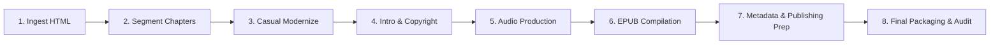

# The Secret Garden — Project Roadmap

**Author:** Frances Hodgson Burnett (1911)
**Status:** Ingestion Complete — Initializing Production Pipeline

---

## ⚙️ The Full Production Pipeline

---

## Stage 1: Source Material Acquisition
- [x] Locate and download the raw public domain HTML source from Project Gutenberg.
- [x] Save as `secret_garden.html` in the project folder.

## Stage 2: Chapter Segmentation & Cleaning
- [x] Parse `secret_garden.html` to extract individual chapters.
- [x] Remove Project Gutenberg headers, footers, boilerplate, and illustration links.
- [x] Save segmented chapters under a `chapters/` directory as `raw_ch_01.txt` to `raw_ch_27.txt`.
- [x] Script: Create `segment_book.py` tailored to Burnett's HTML formatting.

## Stage 3: Language Modernization
- [x] Modernize the Edwardian prose to make it highly accessible for modern casual readers and ESL/EFL learners:
  - [x] **Create a custom `prompt.txt`** for the book outlining specific modernization rules.
  - [x] Process each segmented chapter using the workspace `modernize_book.py` script.
  - [x] Review modernized outputs for flow, tone, and ESL suitability, while retaining Burnett's magical, nature-centric, and emotional style.

## Stage 4: Intro, Overview, and Copyright / Closing
- [x] Draft the introductory and copyright / closing texts:
  - [x] **Opening Credits** (`introduction_en.txt`): Contains only Title, Author, and Narrator name.
  - [x] **Overview** (`overview_en.txt`): Chapter 0 essay introducing the story, author, themes (healing, nature, rejuvenation), and characters (Mary, Colin, Dickon).
  - [x] **Copyright / Closing** (`copyright_en.txt`): Closing credits and copyright statements.
- [x] Produce translated Korean versions (`introduction_ko.txt`, `overview_ko.txt`, `copyright_ko.txt`).

## Stage 5: Audio Production (TTS Generation)
- [ ] Select appropriate voices (e.g., expressive English voice and Korean voice).
- [ ] Generate TTS tracks compiled to `final_audio/` (English) and `final_audio_ko/` (Korean).
  - **Opening Track**: `final_track_00_intro.mp3` (opening credits only).
  - **Overview Track**: `final_track_01.mp3` (overview/chapter 0 essay).
  - **Chapters**: `final_track_02.mp3` onwards (one per chapter).
  - **Closing Track**: Closing credits MP3.
  - **Sample Track**: `sample.mp3` — between 1 and 5 minutes of narration.
- [ ] Verify Audio compliance:
  - Sample rate exactly **44,100 Hz**, CBR at **192 kbps or higher**.
  - RMS between **-23 dB and -18 dB** (target: -19 dB).
  - Peak amplitude no higher than **-3.0 dB**.
  - **1–5 seconds of clean silence** at both the start and end of every track.

## Stage 6: E-book Compilation (EPUB)
- [x] Compile modernized chapters into standard EPUB3 format.
- [x] Scripts: Adapt/run `make_epub.py` (English) and `make_epub_ko.py` (Korean).
- [x] Outputs: `secret_garden.epub`, `secret_garden_ko.epub`.
- [x] Design and optimize cover art (RGB JPEG, 2400×2400px, under 5 MB total EPUB size).

## Stage 7: Metadata & Publishing Prep
- [x] Calculate total runtime of all audio files.
- [x] Draft catchy, sales-optimized titles, subtitles, and descriptions.
- [x] Draft an "About the Author" section for Frances Hodgson Burnett.
- [x] Determine target genres (e.g., Children's Classic Literature, Inspirational Fiction).
- [x] Document details in `metadata.md`.

## Stage 8: Final Packaging & Audit
- [ ] Ensure all `.mp3` files are properly named and backed up.
- [ ] Run `check_audio_quality.py` compliance audit scan on all generated audio files.
- [ ] Audit EPUB for publisher-specific issues and device compatibility.
- [ ] Upload to publishing platforms (Authors Republic, Google Play Books, etc.).

---

## 🏃 Progress Tracker

| Stage | Task | Status |
| :--- | :--- | :--- |
| **Stage 1** | Ingest raw HTML source | ✅ Done |
| **Stage 2** | Segment chapters to `chapters/` | ✅ Done |
| **Stage 3** | Modernize chapters & write `prompt.txt` | ✅ Done |
| **Stage 4** | Write intro, overview & copyright texts (EN + KO) | ✅ Done |
| **Stage 5** | Generate TTS audio tracks (EN + KO) | ⬜ Pending |
| **Stage 6** | EPUB compilation (EN + KO) | ✅ Done |
| **Stage 7** | Metadata, descriptions & publishing prep | ✅ Done |
| **Stage 8** | Final audit & upload to platforms | ⬜ Pending |
