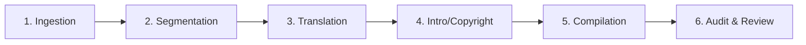

# 🗺️ Of a Happy Life (De Vita Beata) eBook Production & Translation Roadmap

This roadmap tracks the processing of *Of a Happy Life* (De Vita Beata) by Lucius Annaeus Seneca (translated by Aubrey Stewart, 1900) for Korean translation and automated eBook compilation.

---

## ⚙️ The 6-Stage eBook Production Pipeline

---

### Stage 1: Ingestion (Source Text)
- **Action**: Locate clean, public domain English source texts (Wikisource Bohn's Classical Library Edition) and cover assets.
- **Status**: `[x]` Complete (Fetched text from Wikisource page `/wiki/Of_a_Happy_Life`).

---

### Stage 2: Chapter Segmentation
- **Action**: Split the full raw text into 28 separate chapters stored under `books/seneca_on_happiness/chapters/`.
- **Status**: `[x]` Complete (28 chapters extracted as `ch_01_en.txt` to `ch_28_en.txt`).

---

### Stage 3: Translation & Modernization (English & Korean)
- **Action**: Modernize the original English prose into engaging, fluent modern English optimized for TTS/general reading, and translate into Korean style using specialized subagents (rather than direct API scripts) to avoid API key limits.
- **Modernization Status**: `[x]` Complete (Modernized via Gemini Pro subagent).
- **Korean Translation Status**: `[ ]` Pending.
- **Translation & Adaptation Guidelines**:
  - **Methodology**: Use defined subagents acting as professional translators/editors.
  - **Philosophy & Tone**: Deliver Seneca's Stoic reasoning clearly. Avoid heavy Sino-Korean vocabulary that hinders readability while maintaining philosophical accuracy (덕, 이성, 쾌락, 최고선).
  - **Audience**: Style the translation to resonate with modern readers seeking self-help and mindfulness wisdom.

---

### Stage 4: Add Opening and Closing Pages
- **Action**: Create clean, engaging introduction, overview, and closing copyright pages.
- **Status**: `[x]` Complete (Written `metadata.md`, `introduction_en.txt`, `overview_en.txt`, and `copyright_en.txt`).

---

### Stage 5: E-book Compilation
- **Action**: Compile the segmented chapters and metadata into standard EPUB format.
- **Status**: `[x]` Complete (EPUB built using custom `make_epub_native.py` compiler).

---

### Stage 6: Review, Validation, & Quality Control
- **Action**: Audit the compiled book for device compatibility and EPUB standards using verification scripts.
- **Status**: `[x]` Complete (Validated output using `check_epub.py`).
