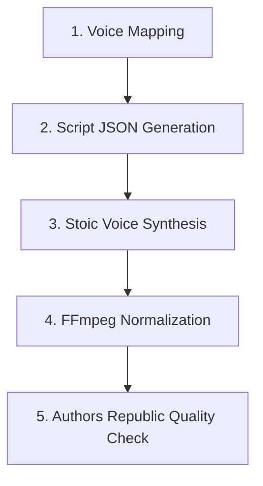

# 🎙️ Seneca: On the Shortness of Life — Audiobook Production Roadmap

**Author**: Lucius Annaeus Seneca  
**Target Edition**: English Stoic Narrator Audiobook (`final_audio/`)  
**Directory**: `d:\git_repo\TKprof_book\books\seneca_shortness_of_life\`

---

## ⚙️ Audiobook Production Pipeline

---

## 🎭 Voice Mapping (Stoic Narrator)

| Role | Voice ID | Style & Direction |
| :--- | :--- | :--- |
| **Stoic Narrator (Seneca)** | `en-US-AndrewNeural` | Deep, calm, reflective, authoritative philosophical tone (`+0%`) |

---

## ⚙️ Technical Quality Standards (Authors Republic / ACX)

- **RMS Volume**: `-23.0 dB` to `-18.0 dB` (Target `-19.0 dB`)
- **Peak Level**: Max `-3.0 dB` (Target `-3.1 dB`)
- **Silence Padding**: Exactly `2.0s` clean room tone at both start and end
- **Bitrate**: `256 kbps CBR MP3`, `44.1 kHz`, 2-Channel

---

## 🏃 Progress Tracker

| Stage | Task | Status |
| :--- | :--- | :--- |
| **Stage 1** | Voice Mapping & Strategy Alignment | ✅ Complete |
| **Stage 2** | Dialogue Tagging & Script Generation | ⬜ Pending |
| **Stage 3** | Audio Track Synthesis (`generate_audio.py`) | ⬜ Pending |
| **Stage 4** | Normalization (`fix_audio_quality.py`) | ⬜ Pending |
| **Stage 5** | Compliance Quality Audit (`check_audio_quality.py`) | ⬜ Pending |
