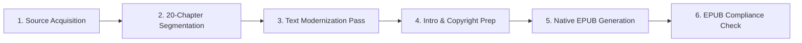

# 📚 Seneca: On the Shortness of Life — eBook Production Roadmap

**Author**: Lucius Annaeus Seneca  
**Edition**: Modernized English Edition (`seneca_shortness_of_life_en.epub`)  
**Directory**: `d:\git_repo\TKprof_book\books\seneca_shortness_of_life\`

---

## ⚙️ eBook Pipeline

---

## 📋 Chapter Plan (20 Classical Chapters)

- [x] `ch_01_en.txt`: Chapter I — The Complaint of Short Life
- [x] `ch_02_en.txt`: Chapter II — How Men Waste Time
- [x] `ch_03_en.txt`: Chapter III — Guarding Your Life's Hours
- [x] `ch_04_en.txt`: Chapter IV — Augustus and the Longing for Leisure
- [x] `ch_05_en.txt`: Chapter V — Cicero's Struggle with Public Life
- [x] `ch_06_en.txt`: Chapter VI — Livius Drusus and Restless Ambition
- [x] `ch_07_en.txt`: Chapter VII — The Distracted Mind
- [x] `ch_08_en.txt`: Chapter VIII — The Illusion of Endless Time
- [x] `ch_09_en.txt`: Chapter IX — Living in the Present
- [x] `ch_10_en.txt`: Chapter X — The Three Times of Life
- [x] `ch_11_en.txt`: Chapter XI — The Fear of Death
- [x] `ch_12_en.txt`: Chapter XII — The Trifles of Trivial Pursuits
- [x] `ch_13_en.txt`: Chapter XIII — Pedantry vs. Wisdom
- [x] `ch_14_en.txt`: Chapter XIV — Friendship with Great Minds
- [x] `ch_15_en.txt`: Chapter XV — True Immortality
- [x] `ch_16_en.txt`: Chapter XVI — The Anxiety of the Busy
- [x] `ch_17_en.txt`: Chapter XVII — The Sudden End of Power
- [x] `ch_18_en.txt`: Chapter XVIII — Paulinus' Advice to Retire
- [x] `ch_19_en.txt`: Chapter XIX — The Dignity of Philosophy
- [x] `ch_20_en.txt`: Chapter XX — The Tranquil Conclusion

---

## 🏃 Progress Tracker

| Stage | Task | Status |
| :--- | :--- | :--- |
| **Stage 1** | Directory Setup & Document Framing | ✅ Complete |
| **Stage 2** | Raw Source Text Acquisition & 20-Chapter Segmentation | ✅ Complete |
| **Stage 3** | Text Modernization Pass (20 Subagents) | ✅ Complete |
| **Stage 4** | Cover Design & EPUB Packaging (`make_epub_native.py`) | ✅ Complete |
| **Stage 5** | EPUB Validation & Verification (`check_epub.py`) | ✅ Complete |
