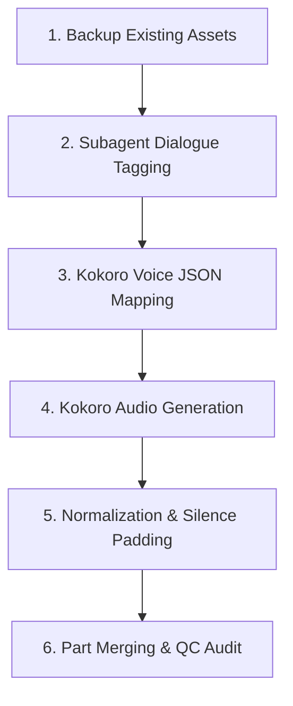

# 🎙️ The Enchanted April (마법에 걸린 4월) — Audiobook Production Roadmap

This roadmap outlines the steps to produce a high-quality, fully compliant multi-voice audiobook for **The Enchanted April** (English & Korean editions) suitable for distribution on Authors Republic, ACX, Apple Books, and Spotify.

---

## ⚙️ The Audiobook Production Pipeline

### Stage 1: Asset Backup
- Back up the existing single-voice MP3 files and generation scripts to prevent data loss.

### Stage 2: Dialogue Tagging (Zero-Cost Subagent)
- Instead of using expensive APIs, invoke a background **Subagent** to read `chapters/ch_*_en.txt` and `ch_*_ko.txt`.
- The subagent will wrap all spoken dialogue in character XML tags (e.g., `<Lotty>...</Lotty>`).
- Output: Tagged text files saved directly to a new `tagged/` directory.

### Stage 3: Multi-Voice Mapping (Kokoro TTS)
- We will assign 3–4 distinct Kokoro-ONNX voices to map the main cast:
  1. **Narrator**
  2. **Lotty / Mrs. Wilkins**
  3. **Rose / Mrs. Arbuthnot**
  4. **Other Characters** (Generic male/female voice for Lady Caroline, Mrs. Fisher, husbands)
- Run `prepare_scripts.py` (EN) and `prepare_scripts_ko.py` (KO) to parse the tagged texts into JSON arrays mapping text segments to their specific Kokoro voice profile.

### Stage 4: Advanced Audio Generation
- Upgrade `generate_audio.py` and `generate_audio_ko.py` to:
  - Generate individual WAV files via the Kokoro ONNX engine.
  - Stitch segments using `pydub`, adding dynamic silence (e.g., 500ms between narrator/character).
  - Export the chapters as 256kbps MP3s to `final_audio/`.
- Generate the retail `sample.mp3` from Chapter 1.

### Stage 5: Normalization & Silence Processing
- Run `fix_audio_quality.py` to apply the Authors Republic compliance filter:
  * Trims existing start/end silence.
  * Normalizes integrated loudness to `-19.0 LUFS`.
  * Limits peaks to max `-3.1 dB`.
  * Pads exactly **2.0 seconds** of leading/trailing silence.
  * Forces output format to exactly `44,100 Hz` sample rate, CBR `256 kbps`.

### Stage 6: Part Merging & QC
- Use `ffmpeg` to concatenate the 22 short chapters into 3 or 4 larger "Parts" to meet distributor requirements for track length.
- Run `check_audio_quality.py` to generate the final compliance report.

---

## 📋 Authors Republic Technical Constraints Checklist

### 🎧 Audio Formatting
- [ ] **File Format**: MP3
- [ ] **Bitrate**: 192kbps or higher CBR (Constant Bit Rate)
- [ ] **Sample Rate**: Exactly 44,100 Hz (44.1 kHz)
- [ ] **Channels**: Consistent across all files (either all mono or all stereo)
- [ ] **RMS Volume**: Between -23.0 dB and -18.0 dB
- [ ] **Peak Level**: Under -3.0 dB (e.g., -3.1 dB)
- [ ] **Noise Floor**: Under -60 dB RMS
- [ ] **Track Silence**: 1.0 to 5.0 seconds of room tone at start/end
- [ ] **Opening Credits**: Strictly contains **only** Title, Author, and Narrator.
- [ ] **Retail Sample**: Between 1.0 and 5.0 minutes, containing actual narration.

---

## 🏃 Progress Tracker

| Stage | Task | Status |
| :--- | :--- | :--- |
| **Stage 1** | Backup existing single-voice files | ✅ Done |
| **Stage 2** | Subagent dialogue tagging (EN & KO) | ✅ Done |
| **Stage 3** | Define Kokoro voice JSON mapping | ✅ Done |
| **Stage 4** | Generate Kokoro multi-voice audio | ✅ Done (Scripts Upgraded & Tested. English stray lines removed from KO Ch 1, 2, 12, 13, 14. Outputs generated as `_fixed.mp3`) |
| **Stage 5** | Run post-processing correction engine | ✅ Done for Korean (all 26 files corrected), ⬜ Pending for English |
| **Stage 6** | Merge Parts and run final QC audit | ✅ Final QC audit passed for Korean (26/26 passed), ⬜ Pending for English |

---

## 🔖 Checkpoint (2026-07-08) — resume here

Before treating Stage 4 as fully closed, a voice-mapping gap surfaced:

- **KO scripts**: 70 lines across chapters 08, 09, 10, 12, 14–22 are tagged `"Other"` (male voice `ko-KR-HyunsuMultilingualNeural`) but surrounding narration names Lady Caroline/Scrap or Mrs. Fisher — likely mis-bucketed. `scripts_ko/classify.py` + `replace_female_others.py` exist but haven't finished the job (and some flags look like false positives — review each line, don't bulk-apply).
- **Decision needed**: map both Lady Caroline/Scrap **and** Mrs. Fisher to Rose (`ko-KR-SunHiNeural`, speed 0.95) — confirmed intent, not yet applied everywhere.
- **EN scripts** (`scripts_en/`) have the same problem with zero tooling: all non-Lotty/Rose lines (595) dump into one male voice `am_michael`. Undecided whether EN needs the same split.
- **Environment blocker**: no single Python env found on this machine has `kokoro` + `pydub` + `soundfile` + `edge-tts` together (checked repo `venv/`, `hermes-agent` venv, and the `uv`-managed cpython install — each missing at least one package). Need to confirm how generation was actually run previously before regenerating any chapters.

**Next steps**: (1) confirm Caroline/Fisher → Rose for KO and decide on EN, (2) confirm working Python invocation, (3) manually patch the 70 flagged KO lines, (4) regenerate only affected chapters, (5) run `fix_audio_quality.py` (Stage 5), (6) merge to Parts + `check_audio_quality.py` (Stage 6).

### Update (2026-07-08, later same day) — decisions made, EN patched

- **KO**: no change — no extra voice available, KO scripts left exactly as-is (the 70 flagged lines stay male "Other").
- **Python env**: confirmed to use `wsl_venv/` (repo root) — has kokoro + edge-tts + pydub + soundfile together, natively in WSL. Do not use the hermes-agent venvs.
- **EN voices picked** (via generated samples in `temp_audio/`, British Kokoro voices): **Scrap → `bf_isabella`** (speed 0.95), **Fisher → `bf_alice`** (speed 0.9).
- **Applied**: `scripts_en/classify_fisher_scrap.py` reclassified 163 high-confidence Fisher lines and 119 high-confidence Scrap lines out of the "Other" bucket across all 22 EN chapters (only lines with an explicit "Mrs. Fisher said" / "Lady Caroline"/"Scrap said" directly adjacent — high precision, spot-checked).
- **`generate_audio.py` patched**: it previously hardcoded a single American (`lang_code='a'`) Kokoro pipeline for every voice, which would have mishandled the new British `bf_` voices. Now picks pipeline by voice prefix (`a`/`b`) lazily.
- **Known unresolved, deliberately deferred**: 313 EN lines remain in "Other". Spot-checking found this bucket mixes (a) real male dialogue (Wilkins/Briggs/Domenico/etc.), (b) apparent mistagged non-dialogue fragments from the original Stage 2 tagging (e.g. single ironic words like `"thrift"` quoted mid-narration), and (c) possibly misattributed Lotty/Rose lines. This is a **pre-existing Stage-2 tagging quality issue**, separate from the Fisher/Scrap voice question, and was explicitly left untouched per user decision — revisit only if asked.
- **Not yet done**: actually regenerating the 16 affected EN chapter tracks with the new Fisher/Scrap voices, then Stage 5 (`fix_audio_quality.py`) and Stage 6 (merge to Parts + `check_audio_quality.py`).

### Update (2026-07-08, evening) — KO audio was stale, full regen kicked off

Found that **all 22 KO chapter scripts were newer than their generated audio** (`scripts_ko/script_ch_*.json` mtimes 07:45–14:07 vs. `final_audio_ko/` audio from Jul 7 22:25 – Jul 8 09:53) — a lot of Korean text/tagging fixes had landed after the last audio generation. Backed up the stale audio to `final_audio_ko_backup_20260708/` and started `python generate_audio_ko.py` (full 22-chapter + intro/closing/sample regen) in the background using `wsl_venv`. Completed successfully (one transient edge-tts failure on Ch14 segment 21, fixed with a clean single-chapter retry). KO Stage 4 audio is now current with the scripts.

### Update (2026-07-08/09) — full EN character-tagging audit, all 22 chapters, 274 fixes applied

User noticed something felt off listening to Rose's lines and asked for a full chapter-by-chapter audit (not just the Fisher/Scrap voice split from earlier) — this went far beyond the originally-deferred "313 lines in Other" issue. Every one of the 22 EN chapters was checked line-by-line against the plain source text in `chapters/ch_XX_en.txt` (the reliable ground truth — narrator attribution like "Mrs. Fisher said"/"he asked" tells you who's actually speaking) and corrected in `scripts_en/script_ch_XX.json`. ch01 and ch10 needed no changes (ch10 is pure narration, zero dialogue). Every other chapter had errors — **274 total fixes**, breakdown per chapter in this order: ch02(7) ch03(11) ch04(3) ch05(4) ch06(4) ch07(9) ch08(2) ch09(18) ch11(8) ch12(39) ch13(4) ch14(13) ch15(13) ch16(8) ch17(27) ch18(19) ch19(21) ch20(8) ch21(18) ch22(38).

Recurring bug patterns found (useful if this ever needs auditing again, e.g. for Korean):
1. **Mr. Wilkins / Mrs. Wilkins (Lotty) surname confusion** — his lines repeatedly landed on her character tag and vice versa, densest in ch14/15/17.
2. **"Name mentioned in the quote → wrongly assigned to that name"** — e.g. "Rose!" exclaimed *by Frederick* got tagged Rose (ch20, the case that started this audit); "Lotty has a theory" *said by Rose, about Lotty* got tagged Lotty (ch09).
3. **Multi-part quotes split by a narrator interjection** (`"...," he said, "..."`) — only the first fragment kept the correct speaker; continuation fragments drifted to the wrong character or to generic "Other."
4. **Dense multi-character scenes were worst** — ch09 (4-way lunch: Fisher/Francesca + Rose/Lotty/Scrap), ch12 (4-way dinner table), ch22 (ending banter) each had 18–39 errors, sometimes over half the scene's lines misattributed.

Also carved out **Costanza** (the cook) as her own character in ch08 — her whole single-quote-punctuated scene with Scrap had never been split into dialogue segments at all (single quotes `'...'` weren't recognized by the original Stage-2 tagger, unlike double quotes), so it was one giant flat Narrator blob. Re-segmented it manually into proper Narrator/Scrap/Costanza lines. Costanza's voice: `bf_lily`.

**Still not applied**: Francesca (`bf_emma`, decided but paused mid-verification — some candidate lines were false positives where she's merely mentioned, not speaking) and the general Other-male/Other-female split (planned, not started). Both are lower priority than the audit that just finished.

**Not yet done**: regenerate EN audio for every one of the ~19 affected chapters (all of ch02-22 except ch10) with `generate_audio.py` now that the scripts are fixed, then Stage 5 (`fix_audio_quality.py`) and Stage 6 (merge to Parts + `check_audio_quality.py`) for both languages. KO audio is current; EN audio was last generated before this whole audit and is now stale everywhere the scripts changed.
