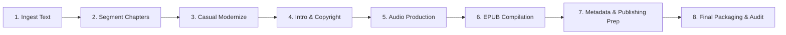

# The Enchanted April — Project Roadmap

**Author:** Elizabeth von Arnim (1922)
**Status:** Audio Production Complete — Publishing Prep Pending

---

## ⚙️ The Full Production Pipeline

---

## Stage 1: Source Material Acquisition
- [x] Locate and download the raw public domain text (1922, Project Gutenberg).
- [x] Save as `the_enchanted_april_raw.txt`.

## Stage 2: Chapter Segmentation
- [x] Split the full text into separate raw chapters stored under `chapters/` directory.
- [x] Remove Gutenberg boilerplate, project notes, and prefaces that aren't part of the core novel.
- [x] Script: `segment_book.py`

## Stage 3: Language Modernization
- [x] Modernize the Edwardian prose to make it highly accessible for modern casual readers and ESL/EFL learners:
  - [x] **Create a custom `prompt.txt`** for the book outlining specific modernization rules.
  - [x] Process each segmented chapter using a `modernize_book.py` script (or equivalent).
  - [x] Review modernized outputs for flow, tone, and ESL suitability, while retaining von Arnim's warm, witty, and gently ironic voice.

## Stage 4: Intro and Copyright / Closing
- [x] Draft the introduction and copyright / closing texts:
  - **Opening Credits** (`introduction_en.txt`): Contains only Title, Author, and Narrator name.
  - **Overview** (`overview_en.txt`): Chapter 0 essay introducing the story and author.
  - **Copyright / Closing** (`copyright_en.txt`): Closing credits and copyright statements.
- [x] Korean versions produced (`introduction_ko.txt`, `overview_ko.txt`, `copyright_ko.txt`).

## Stage 5: Audio Production (TTS Generation)
- [x] Voice: `en-GB-RyanNeural` (English), Korean voice (Korean edition).
- [x] No cinematic music bumpers — pure narration voice.
- [x] Generated TTS tracks compiled to `final_audio/` (English) and `final_audio_ko/` (Korean).
  - **Opening Track**: `final_track_00_intro.mp3` (opening credits only).
  - **Overview Track**: `final_track_01.mp3` (overview/chapter 0 essay).
  - **Chapters**: `final_track_02.mp3` onwards (one per chapter).
  - **Closing Track**: Closing credits MP3.
  - **Sample Track**: `sample.mp3` — between 1 and 5 minutes of actual narration (not credits).
- [x] Audio compliance target: 44,100 Hz sample rate, 192+ kbps CBR, -19.0 LUFS, peaks under -3.0 dB, 2.0 sec leading/trailing silence padding.

### 🎵 Audio Structure (per chapter)
Each chapter audio is assembled as:
1. **Narration** — pure voice, no background music or sound effects.
2. **Silence padding** — 2.0 seconds leading and 2.0 seconds trailing room tone.

## Stage 6: E-book Compilation (EPUB)
- [x] Compile modernized chapters into standard EPUB3 format.
- [x] Scripts: `make_epub.py` (English), `make_epub_ko.py` (Korean).
- [x] Outputs: `the_enchanted_april.epub`, `the_enchanted_april_ko.epub`.
- [x] Cover art optimized (RGB JPEG, 2400×2400px, under 5 MB total EPUB size).

## Stage 7: Metadata & Publishing Prep
- [x] Calculate total runtime of all audio files to determine Audible/ACX pricing tier.
- [x] Draft a catchy, sales-optimized Title, Subtitle, and Description.
- [x] Draft an "About the Author" section for Elizabeth von Arnim.
- [x] Determine the best target genres (e.g., Classic Fiction, Women's Literature, Romance).
- [x] Digital Marketing & SEO: Ensure listing metadata leverages appropriate keywords.
- [x] Document created at `metadata.md`.

## Stage 8: Final Packaging & Audit
- [ ] Ensure all `.mp3` files are properly named and backed up in an `audio_archive` directory.
- [x] Run `check_audio_quality.py` compliance audit scan before uploading. (Passed for both EN and KO)
- [ ] Audit EPUB for publisher-specific issues and device compatibility.
- [ ] Upload to publishing platforms (Authors Republic, ACX, Google Play Books, etc.).

---

## 🏃 Progress Tracker

| Stage | Task | Status |
| :--- | :--- | :--- |
| **Stage 1** | Ingest raw text source | ✅ Done |
| **Stage 2** | Segment chapters to `chapters/` | ✅ Done |
| **Stage 3** | Modernize chapters & write `prompt.txt` | ✅ Done |
| **Stage 4** | Write intro, overview & copyright texts (EN + KO) | ✅ Done |
| **Stage 5** | Generate TTS audio tracks (EN + KO) | ✅ Done |
| **Stage 6** | EPUB compilation (EN + KO) | ✅ Done |
| **Stage 7** | Metadata, descriptions & publishing prep | ✅ Done |
| **Stage 8** | Final audit & upload to platforms | ⬜ Pending |
