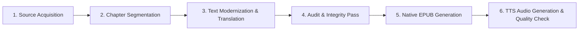

# 📚 The Heroes: Greek Fairy Tales — eBook & Audio Roadmap

**Author**: Charles Kingsley  
**Original Title**: *The Heroes; Or, Greek Fairy Tales for My Children* (1856)  
**Directory**: `c:\git_repo\TKprof_book\books\the_heroes\`  
**Source**: Project Gutenberg eBook #677 (Public Domain)

---

## ⚙️ Production Pipeline

---

## 📋 Chapter Plan & Structure (100% JSON-First Architecture)

All raw, modernized English (`en`), and Korean (`ko`) texts are maintained **exclusively within JSON files**. No `.txt` files (`en.txt`, `kr.txt`) are used.

| Chapter ID | Primary JSON Data | Story / Section | Part / Subtitle | Items | Status |
| :--- | :--- | :--- | :--- | :--- | :--- |
| `ch_00` | [`json/ch_00.json`](file:///c:/git_repo/TKprof_book/books/the_heroes/json/ch_00.json) | Preface | To My Children (Rose, Maurice, and Mary) | 17 | ✅ Modernized |
| `ch_01` | [`json/ch_01.json`](file:///c:/git_repo/TKprof_book/books/the_heroes/json/ch_01.json) | Story I: Perseus | Part I: How Perseus and His Mother Came to Seriphos | 24 | ✅ Modernized |
| `ch_02` | [`json/ch_02.json`](file:///c:/git_repo/TKprof_book/books/the_heroes/json/ch_02.json) | Story I: Perseus | Part II: How Perseus Vowed a Rash Vow | 62 | ⬜ Pending |
| `ch_03` | [`json/ch_03.json`](file:///c:/git_repo/TKprof_book/books/the_heroes/json/ch_03.json) | Story I: Perseus | Part III: How Perseus Slew the Gorgon | 50 | ⬜ Pending |
| `ch_04` | [`json/ch_04.json`](file:///c:/git_repo/TKprof_book/books/the_heroes/json/ch_04.json) | Story I: Perseus | Part IV: How Perseus Came to the Æthiops | 67 | ⬜ Pending |
| `ch_05` | [`json/ch_05.json`](file:///c:/git_repo/TKprof_book/books/the_heroes/json/ch_05.json) | Story I: Perseus | Part V: How Perseus Came Home Again | 33 | ⬜ Pending |
| `ch_06` | [`json/ch_06.json`](file:///c:/git_repo/TKprof_book/books/the_heroes/json/ch_06.json) | Story II: The Argonauts | Part I: How the Centaur Trained the Heroes on Pelion | 47 | ⬜ Pending |
| `ch_07` | [`json/ch_07.json`](file:///c:/git_repo/TKprof_book/books/the_heroes/json/ch_07.json) | Story II: The Argonauts | Part II: How Jason Lost His Sandal in Anauros | 65 | ⬜ Pending |
| `ch_08` | [`json/ch_08.json`](file:///c:/git_repo/TKprof_book/books/the_heroes/json/ch_08.json) | Story II: The Argonauts | Part III: How They Built the Ship 'Argo' in Iolcos | 13 | ⬜ Pending |
| `ch_09` | [`json/ch_09.json`](file:///c:/git_repo/TKprof_book/books/the_heroes/json/ch_09.json) | Story II: The Argonauts | Part IV: How the Argonauts Sailed to Colchis | 110 | ⬜ Pending |
| `ch_10` | [`json/ch_10.json`](file:///c:/git_repo/TKprof_book/books/the_heroes/json/ch_10.json) | Story II: The Argonauts | Part V: How the Argonauts Were Driven into the Unknown Sea | 128 | ⬜ Pending |
| `ch_11` | [`json/ch_11.json`](file:///c:/git_repo/TKprof_book/books/the_heroes/json/ch_11.json) | Story II: The Argonauts | Part VI: What Was the End of the Heroes | 10 | ⬜ Pending |
| `ch_12` | [`json/ch_12.json`](file:///c:/git_repo/TKprof_book/books/the_heroes/json/ch_12.json) | Story III: Theseus | Part I: How Theseus Lifted the Stone | 24 | ⬜ Pending |
| `ch_13` | [`json/ch_13.json`](file:///c:/git_repo/TKprof_book/books/the_heroes/json/ch_13.json) | Story III: Theseus | Part II: How Theseus Slew the Devourers of Men | 163 | ⬜ Pending |
| `ch_14` | [`json/ch_14.json`](file:///c:/git_repo/TKprof_book/books/the_heroes/json/ch_14.json) | Story III: Theseus | Part III: How Theseus Slew the Minotaur | 31 | ⬜ Pending |
| `ch_15` | [`json/ch_15.json`](file:///c:/git_repo/TKprof_book/books/the_heroes/json/ch_15.json) | Story III: Theseus | Part IV: How Theseus Fell by His Pride | 23 | ⬜ Pending |
| **Total** | **16 Chapters** | **3 Stories + Preface** | **15 Story Parts** | **867 Items** | **41 Modernized** |

---

## 🏃 Progress Tracker

| Stage | Task | Status | Details |
| :--- | :--- | :--- | :--- |
| **Stage 1** | Directory Setup & Document Framing | ✅ Complete | Created `books/the_heroes/` directory, `download_book.py`, `split_chapters.py`, `metadata.md`, `roadmap.md`, and `prompt.txt`. |
| **Stage 2** | Raw Source Text Acquisition | ✅ Complete | Downloaded Project Gutenberg eBook #677 (280,376 characters, UTF-8). Saved as `the_heroes_raw.txt`. |
| **Stage 3** | JSON Dataset Architecture (100% JSON-First) | ✅ Complete | Generated master `the_heroes_raw.json` (867 items, 47.6K words) and 16 chapter JSONs in `json/`. Eliminated intermediate `.txt` files. |
| **Stage 4** | Text Modernization (`raw` -> `en`) | 🔄 In Progress | Modernized `ch_00` and `ch_01` (41 items). 826 items remaining in `work_queue.json`. |
| **Stage 5** | Audit & Integrity Pass | ⬜ Pending | Verify 0 missing items, 1:1 paragraph parity, and no leftover archaic terms. |
| **Stage 6** | Native EPUB Generation | ⬜ Pending | Build native EPUB directly from `json/ch_XX.json`. |
| **Stage 7** | Audio Script & TTS Validation | ⬜ Pending | Audio script preparation and validation against Author's Republic / ACX audio standards directly from JSON. |
