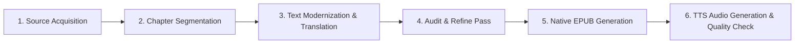

# 📚 Tono-Bungay — eBook & Audio Roadmap

**Author**: H. G. Wells  
**Editions**: Modernized English Edition (`tono_bungay_en.epub`) & Korean Edition (`tono_bungay_ko.epub`)  
**Directory**: `d:\git_repo\TKprof_book\books\burnt_bungay\` / `d:\git_repo\TKprof_book\books\tono_bungay\`

---

## ⚙️ Production Pipeline

---

## 📋 Chapter Plan Structure

H.G. Wells' *Tono-Bungay* is divided into 4 Books:

### Book 1: The Days Before Commerce
Located in `chapters/book1/`:
* Chapters 1 to N (e.g., `book1_ch01_en.txt`, `book1_ch01_ko.txt`, `book1_ch01_ko_v2.txt`)

### Book 2: Of the Remarkable Growth of Tono-Bungay
Located in `chapters/book2/`:
* Chapters 1 to N

### Book 3: The Great Days of Tono-Bungay
Located in `chapters/book3/`:
* Chapters 1 to N

### Book 4: Love and the Ocean
Located in `chapters/book4/`:
* Chapters 1 to N

---

## 🏃 Progress Tracker

| Stage | Task | Status | Details |
| :--- | :--- | :--- | :--- |
| **Stage 1** | Directory Setup & Document Framing | ✅ Complete | Created `books/tono_bungay/` directory, `roadmap.md`, `prompt.txt`, and `prompt_ko.txt`. |
| **Stage 2** | Raw Source Text Acquisition | ✅ Complete | Downloaded Project Gutenberg eBook #718 (787K characters). |
| **Stage 3** | Chapter Segmentation & Setup | ✅ Complete | Segmented raw source into Books 1-4 (14 chapters) in `chapters/`. |
| **Stage 4** | Text Modernization & Translation | ✅ Complete | Explanatory Translation Loop (EN -> KO -> EN) fully executed across all 14 chapters. |
| **Stage 5** | Audit & Refine Pass | ✅ Complete | Verified clean paragraph integrity, non-empty outputs, and inline contextual explanations. |
| **Stage 6** | EPUB Generation | ✅ Complete | Built `tono_bungay_en.epub` (498KB) and `tono_bungay_ko.epub` (505KB). |
| **Stage 7** | Audio Script & TTS Validation | ⬜ Pending | Prepare audio scripts and verify ACX/Author's Republic audio standards. |
