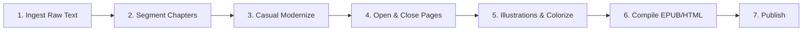

# 🗺️ Parallel Multi-Book eBook Production Roadmap & Tracker

This roadmap guides the parallel processing of our selected classic books for modernization and automated eBook compilation.

---

## ⚙️ The 4-Stage eBook Production Pipeline

For each book, we execute the following standardized steps:

### Stage 1: Ingestion (Source Text)
- **Action**: Locate clean, public domain English source texts (e.g., from Project Gutenberg or Standard Ebooks).
- **Output**: Save raw text file to `books/{book_dir}/raw_source.txt`.

### Stage 2: Chapter Segmentation
- segmentation before modernization, so review can start by chapter. 
- **Action**: Split full text into separate chapters (`ch_01_en.txt`, etc.) stored under `books/{book_dir}/chapters/`.

### Stage 3: Modernization chapter by chapter
- tried automated script , just remove right away, wasted token. 
- will just use chat, and if used up will take break. 
- **Action**: Simplify the original challenging English narrative (Victorian, ancient, or formal prose) to a clear, engaging, middle-school level modern English style (ideal for ESL/EFL learners and casual readers).  will keep _i_ _me_ ( italic ) for now.
- **Output**: Save modernized chapters to `books/{book_dir}/chapters/ch_01_en.txt` (or `book2_ch_XX_en.txt`, etc.).
- **Status**: `[x]` Complete. All 3 Books (45 Chapters) fully modernized.
- **Review**: `[x]` The surgical fixes (Subject-first, no dashes) have been verified and applied to all flagged sentences via `surgical_fix_list.md`.

### Stage 4 : Add opening and closing
- **Action**: add opening introduction to reader , closing copyright feedback. (Complete) 
- **Note**: `copyright_en.txt` was successfully updated and synchronized to match the exact modernized layout of *The Scarlet Letter*, including the specialized 'Note on This Modernized Edition' section. 

### Stage 5: Illustrations & Colorization
- **Action**: Extract original illustrations from Gutenberg source, colorize them, and insert them into the EPUB.
- **Status**: `[x]` Complete. All 16 original illustrations have been successfully downloaded, beautifully colorized in a watercolor style, and successfully injected into the EPUB chapter texts.

### Stage 6: E-book Compilation
- **Action**: Run `books/compile_ebooks.py` to compile the segmented chapters into standard formats:
  - **EPUB**: The primary digital reading format for Google Play Books, Amazon KDP, and general e-readers.
  - **HTML**: A web-friendly version for landing pages or direct previews.
- **Status**: `[x]` Complete. EPUB and HTML successfully built for the modernized text. (Will need to re-compile once illustrations are ready).
