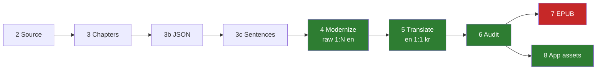

# 📚 The Sorrows of Young Werther — eBook & Audio Roadmap

**Author**: Johann Wolfgang von Goethe
**Original Title**: *Die Leiden des jungen Werthers* (1774; rev. 1787)
**Translator**: R. Dillon Boylan (1854)
**Directory**: `c:\git_repo\TKprof_book\books\werther\`
**Source**: Project Gutenberg eBook #2527 (Public Domain)

---

## 📊 Status at a Glance

> Regenerate this file's chapter table with `python status.py --write`.
> Progress is read from `json/ch_NN.json`, never hand-maintained.

| | |
| :--- | :--- |
| **Now** | Read it on a device, then Stage 7 (EPUB) and store assets |
| **Modernization** | `████████████████████████████` 352 / 352 items |
| **Translation** | `████████████████████████████` 2,519 / 2,519 entries |
| **Projected app cards** | 1,223 · en mean 183 / max 300 · ko mean 94 / max 186 · **0 over cap** |
| **Blocked on** | nothing |

Korean runs about half the character length of the English for the same content (ratio 0.51), so the 300-char cap is set by the English side; the Korean never approaches it.

---

## ⚙️ Production Pipeline



Green is done, red is next. Stages 7 and 8 both read the same finished JSON and are independent of each other.

---

## 📐 Source Anatomy

The raw text is **double-spaced**: wrapped lines are separated by one blank line, and paragraphs by two. Every script must normalize with `text.replace("\n\n", "\n")` before paragraph detection, or it will read every wrapped line as its own paragraph.

| Section | Lines (normalized) | Words | Span |
| :--- | :--- | ---: | :--- |
| PREFACE | 46–62 | 95 | Editor's framing note |
| BOOK I | 62–1854 | 19,137 | May 4 – Sep 10, 1771 |
| BOOK II. | 1854–2983 | 11,641 | Oct 20, 1771 – Dec 6, 1772 |
| THE EDITOR TO THE READER. | 2983–4086 | 11,607 | Third-person narration |
| **Total** | | **42,516** | **84 dated letters** |

Letter headers match `^(MONTH) \d+[.,]?(\s*\d{4})?\.?$` — uppercase month, anchored. A case-insensitive match produces 6 false positives from wrapped lines beginning "may…".

---

## 📋 Chapter Plan & Structure (100% JSON-First Architecture)

Letters are **not** chapters — they range from 18 to 3,042 words. 15 chapters are formed by grouping letters into dated spans of ~2,250–3,400 words. The 95-word PREFACE is folded into Chapter 1. The Editor's narration has no date headers and is cut on scene boundaries instead.

| Chapter | Section | Span / Scene | Title (EN) | Title (KO) | Words | Letters |
| :--- | :--- | :--- | :--- | :--- | ---: | ---: |
| `ch_01` | Book I | Preface + May 4 – May 17 | Arrival | 도착 | 2,333 | 6 |
| `ch_02` | Book I | May 22 – May 30 | Wahlheim | 발하임 | 2,251 | 4 |
| `ch_03` | Book I | June 16 | The Ball | 무도회 | 3,042 | 1 |
| `ch_04` | Book I | June 19 – July 1 | In Love | 사랑에 빠지다 | 2,784 | 4 |
| `ch_05` | Book I | July 6 – July 30 | Albert | 알베르트 | 2,760 | 13 |
| `ch_06` | Book I | August 8 – August 12 | The Pistols | 권총 | 2,663 | 3 |
| `ch_07` | Book I | August 15 – September 10 | Departure | 이별 | 3,397 | 8 |
| `ch_08` | Book II | October 20 – February 20 | In the Ambassador's Service | 공사관에서 | 2,792 | 7 |
| `ch_09` | Book II | March 15 – July 29 | Disgrace and Departure | 모욕과 사직 | 2,979 | 10 |
| `ch_10` | Book II | August 4 – October 30 | Return to Wahlheim | 발하임으로 돌아오다 | 2,998 | 14 |
| `ch_11` | Book II | November 3 – December 6 | Descent | 무너져 가는 마음 | 2,870 | 11 |
| `ch_12` | Editor | Preamble → the peasant lad | The Editor to the Reader | 엮은이가 독자에게 | 3,022 | 3 |
| `ch_13` | Editor | Charlotte's resolve → the last visit | The Last Visit | 마지막 방문 | 2,422 | 0 |
| `ch_14` | Editor | The Ossian reading → Werther flees | Ossian | 오시안 | 2,786 | 0 |
| `ch_15` | Editor | The final letters → the death | The Final Night | 마지막 밤 | 3,377 | 0 |
| **Total** | **3 sections** | **84 letters + narration** | **15 chapters** | | **42,476** | **84** |

### Live progress

<!-- BEGIN GENERATED: chapters -->

| Chapter | Items | Modernized | Entries | Korean | Cards | Mean | Max | Over cap |
| :--- | ---: | ---: | ---: | ---: | ---: | ---: | ---: | ---: |
| `ch_01` | 24 | ✅ | 140 | ✅ | 62 | 188 | 298 | 0 |
| `ch_02` | 16 | ✅ | 119 | ✅ | 59 | 205 | 298 | 0 |
| `ch_03` | 26 | ✅ | 152 | ✅ | 78 | 199 | 295 | 0 |
| `ch_04` | 19 | ✅ | 144 | ✅ | 71 | 207 | 298 | 0 |
| `ch_05` | 40 | ✅ | 192 | ✅ | 89 | 164 | 299 | 0 |
| `ch_06` | 30 | ✅ | 138 | ✅ | 73 | 195 | 298 | 0 |
| `ch_07` | 27 | ✅ | 189 | ✅ | 97 | 185 | 298 | 0 |
| `ch_08` | 31 | ✅ | 145 | ✅ | 83 | 181 | 300 | 0 |
| `ch_09` | 32 | ✅ | 188 | ✅ | 89 | 175 | 298 | 0 |
| `ch_10` | 42 | ✅ | 180 | ✅ | 94 | 170 | 298 | 0 |
| `ch_11` | 28 | ✅ | 181 | ✅ | 86 | 174 | 298 | 0 |
| `ch_12` | 39 | ✅ | 154 | ✅ | 88 | 189 | 295 | 0 |
| `ch_13` | 21 | ✅ | 133 | ✅ | 63 | 204 | 295 | 0 |
| `ch_14` | 24 | ✅ | 233 | ✅ | 88 | 165 | 281 | 0 |
| `ch_15` | 39 | ✅ | 231 | ✅ | 103 | 176 | 298 | 0 |
| **Total** | **438** | **352/352** | **2519** | **2519/2519** | **1223** | | **300** | **0** |

<!-- END GENERATED: chapters -->

---

## 🏃 Progress Tracker

| Stage | Task | Status | Details |
| :--- | :--- | :--- | :--- |
| **Stage 1** | Directory Setup & Document Framing | ✅ Complete | Created `books/werther/`, `download_book.py`, `split_chapters.py`, `metadata.md`, `roadmap.md`. |
| **Stage 2** | Raw Source Text Acquisition | ✅ Complete | Downloaded Project Gutenberg eBook #2527 (259,106 characters, 4,437 lines, UTF-8). Saved as `werther_raw.txt`. |
| **Stage 3** | Chapter Segmentation | ✅ Complete | `split_chapters.py` writes 15 files to `chapters/` (2,251–3,397 words each, all 84 letters accounted for). |
| **Stage 3b** | JSON Dataset Architecture | ✅ Complete | `make_json.py` → `json/ch_01..15.json` + master `werther_raw.json`. 438 items, 84 letters, 42,476 words. |
| **Stage 3c** | Sentence Splitting & Queue | ✅ Complete | `split_sentences.py` → `translation[]` scaffold, 86 headers filled deterministically, 352 items queued across 15 batches in `batches/`. 2,246 suggested sentences. |
| **Stage 4** | Text Modernization (`raw` → `en`, 1:N) | ✅ Complete | All 15 chapters. 352 body items → **2,519 entries** (1:7.2). Projected app cards: **1,223, mean 183 chars, max 300, none over the cap.** |
| **Stage 5** | Korean Translation (`en` → `kr`, 1:1) | ✅ Complete | All 15 chapters, **2,519/2,519 entries**. Zero empty, zero glossary misses. Werther's letters in plain diary register; the Editor's four chapters in third-person narration; ch_14 (Ossian) in an elevated bardic register. Applied with `apply_translation.py`, which enforces 1:1 alignment, a no-English-leak check, and the `metadata.md` glossary. |
| **Stage 6** | Audit & Integrity Pass | ✅ Complete | `audit_werther.py` — structure, raw-coverage, card caps, ending parity, Korean leaks + glossary. **0 errors, 4 warnings** (all Korean correctly ending a sentence where English runs on with `:`/`;`). Exit code gates migrate. |
| **Stage 7** | Native EPUB Generation | ⬜ Pending | Build EPUB directly from `json/ch_XX.json`. |
| **Stage 8** | App Migration | ✅ Complete | `migrate_werther.py` → `Book_apps/werther/src/main/assets/books/ch_01..15.json`. **1,238 cards, 102 headers.** Gradle module scaffolded, `:werther` added to `settings.gradle.kts`. Icon and theme are placeholders. |

---

## 🧾 JSON Item Schema

Each item in `json/ch_XX.json`:

```json
{
  "id": 5, "tag": "P0005", "chapter_id": "ch_01",
  "section": "Book I", "letter": "MAY 4.",
  "raw": "How happy I am that I am gone! My dear friend, what a thing is the heart of man! ...",
  "is_header": false, "word_count": 410, "sentence_count": 21,
  "translation": [
    { "id": 1, "en": "How happy I am to be gone!", "kr": "" },
    { "id": 2, "en": "My dear friend, what a strange thing the human heart is!", "kr": "" }
  ]
}
```

* Chapter titles are **not** repeated on items — they live once per chapter in the master `werther_raw.json` and are joined on `chapter_id`.
* `letter` names the dated letter a paragraph belongs to, so the translator always knows whose voice is speaking. The Editor's narration carries `null` (118 of 438 items).
* `is_header` marks the 84 letter dates plus `PREFACE` and `THE EDITOR TO THE READER.`
* After Stage 3c an item carries `sentence_count` and `translation: []`; the item-level `en`/`ko` are removed. **Progress state lives entirely in the files**: `translation == []` needs Stage 4, an entry with `kr == ""` needs Stage 5. Re-running `split_sentences.py` never clobbers finished work, so an interrupted run resumes for free.
* Paragraphs run up to 4,708 characters (45 exceed 1,200). They are translation *parents*; the ≤300-character app cards are produced later by sentence splitting plus the 3-sentence chunking in `migrate_werther.py`.

---

## 🔧 Carried Forward to Stage 8 (migrate) — ✅ all handled

Three things `migrate_werther.py` had to handle. None could be fixed upstream — re-running `make_json.py` would have discarded all 2,519 finished entries.

| # | Issue | Required handling |
| :--- | :--- | :--- |
| 1 | **ch_13–15 have no leading header item** | ✅ Solved more broadly than planned: the canonical title is prepended to **every** chapter. Prepending only to the headerless ones left chapters 2–11 showing a bare `May 22` in the drawer with no chapter name. A chapter whose own first header duplicates the title (ch_12) has it suppressed. |
| 2 | **Two date lines sit in body items**: `ch_08` id 187, `ch_09` id 220 | ✅ Promoted to header cards, with the Korean date generated the same way as the other 84. |
| 3 | **84 letter dates are `is_header`** | ✅ Accepted as designed. Drawer now reads `Wahlheim - May 22` / `발하임 - 5월 22일`, naming and dating each chapter. No change to `:shared`, so the five shipped apps are untouched. |

---

## 🧪 Guards in the Pipeline

Each was added after it caught a real defect, not speculatively.

| Script | Guard | Caught |
| :--- | :--- | :--- |
| `split_sentences.py` | Rejoined sentences must equal `raw` ignoring whitespace | A closing quote written as part of the split separator was being **consumed**, silently deleting one character from 3 items |
| `apply_modernization.py` | Every number and proper noun in `raw` must appear in the new English | `Morglan` dropped from ch_14 id 388 — a truncated read meant one sentence of the paragraph was never written |
| `apply_modernization.py` | `STOP` list + ALL-CAPS skip + position-blind presence check | False positives on `God`, `With` (a source typo: "exclaimed With eagerness"), `'Tis`, and `THE SAME EVENING.` |

`apply_modernization.py` **refuses the whole chapter** on any failure rather than warning, so a bad pass cannot land in the data.

---

## ⚠️ Content Note

The novel ends in the protagonist's suicide, described in clinical detail in Chapter 15. The Play Store listing and the app's store description should carry a content advisory, and the KDP listing should be rated accordingly.
