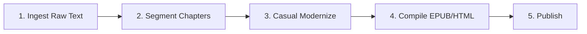

# 🗺️ Parallel Multi-Book eBook Production Roadmap & Tracker

This roadmap guides the parallel processing of our selected classic books for modernization and automated eBook compilation.

---

## ⚙️ The 4-Stage eBook Production Pipeline

For each book, we execute the following standardized steps:

### Stage 1: Ingestion (Source Text)
- **Action**: Locate clean, public domain English source texts (e.g., from Project Gutenberg or Standard Ebooks).
- **Output**: Save raw text file to `books/{book_dir}/raw_source.txt`.

### Stage 2: Chapter Segmentation
- segmentation before modernization, so review can start by chapter. 
- **Action**: Split full text into separate chapters (`ch_01_en.txt`, etc.) stored under `books/{book_dir}/chapters/`.

### Stage 3: Modernization chapter by chapter
- **Action**: Simplify the original challenging English narrative (Victorian, ancient, or formal prose) to a clear, engaging, middle-school level modern English style (ideal for ESL/EFL learners and casual readers).
- **Output**: Save modernized chapters to `books/{book_dir}/chapters/ch_01_en.txt`.
- **Action**: here human review is must to make sure the quality is good.

### Stage 4 : Add opening and closing
- **Action**: add opening introduction to reader , closing copyright feedback. 

### Stage 5: E-book Compilation
- **Action**: Run `books/compile_ebooks.py` to compile the segmented chapters into standard formats:
  - **EPUB**: The primary digital reading format for Google Play Books, Amazon KDP, and general e-readers.
  - **HTML**: A web-friendly version for landing pages or direct previews.

---

## 📊 Parallel Production Tracker

Below is the master progress matrix for the target English-to-English books.

| # | Book Title | 1. Ingest | 2. Segment | 3. Modernize | 4. Compile | 5. Publish |
| :-: | :--- | :---: | :---: | :---: | :---: | :---: |
| 5 | **A Tale of Two Cities** | `[x]` | `[x]` | `[]` | `[]` | `[ ]` |
