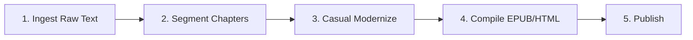

# 🗺️ Parallel Multi-Book eBook Production Roadmap & Tracker

This roadmap guides the parallel processing of our selected classic books for modernization and automated eBook compilation.

---

## ⚙️ The 4-Stage eBook Production Pipeline

For each book, we execute the following standardized steps:

### Stage 1: Ingestion (Source Text)
- **Action**: Locate clean, public domain English source texts (e.g., from Project Gutenberg or Standard Ebooks).
- **Output**: Save raw text file to `books/{book_dir}/raw_source.txt`.

### Stage 2: Chapter Segmentation
- segmentation before modernization, so review can start by chapter. 
- **Action**: Split full text into separate chapters (`ch_01_en.txt`, etc.) stored under `books/{book_dir}/chapters/`.

### Stage 3: Modernization chapter by chapter
- tried automated script , just remove right away, wasted token. 
- will just use chat, and if used up will take break. 
- **Action**: Simplify the original challenging English narrative (Victorian, ancient, or formal prose) to a clear, engaging, middle-school level modern English style (ideal for ESL/EFL learners and casual readers).
- **Output**: Save modernized chapters to `books/{book_dir}/chapters/ch_01_en.txt`.
- **Action**: here human review is must to make sure the quality is good.

### Stage 4: Add Opening and Closing Pages
- **Action**: Create clean, engaging introduction and closing pages to frame the modernized work.
- **Opening Page (`introduction_en.txt`)**:
  - **Title**: `A Note to the Reader` (Header `<h1>`).
  - **Contents**: Include historical context, plot themes, target audience (ESL/EFL learners, student readers), and explanatory notes about modernization layout choices (such as moving academic introductions like "The Custom-House" to the back to keep the narrative start engaging).
  - **Constraint**: Ensure the main title is not repeated as standard text in the body to avoid double-reading in audiobooks.
- **Closing Page (`copyright_en.txt`)**:
  - **TOC Title**: `Copyright & About This Edition`.
  - **Structure**:
    1. **Thank You for Reading**: A reader-appreciation section placed at the top.
    2. **Feedback & Review Request**: Call-to-action asking for reviews or ratings on platforms.
    3. **About This Modernized Edition**: Detailed editorial notes regarding casual modernization rules, drop cap restoration, and AI colorized illustrations.
    4. **Word Count Comparison**: A clear mention of the word count comparison between the original text and this modernized casual English edition.
    5. **Copyright Notice**: Standard legal licensing statement and publisher details (`TKPROF LLC`).
  - **Constraint**: Segment titles (e.g. "Thank You", "About This Edition") must be promoted to semantic `<h2>` headings for navigation instead of plain `
` paragraphs.

### Stage 5: E-book Compilation
   A lot of issues in each chapters, only after manual full approval proceed. 
- **Action**: Run `books/compile_ebooks.py` to compile the segmented chapters into standard formats:
  - **EPUB**: The primary digital reading format for Google Play Books, Amazon KDP, and general e-readers.
  - **HTML**: A web-friendly version for landing pages or direct previews.

### Stage 6: Review, Validation, & Optimization (Publisher Readiness Audit)
Before publishing, the book must be audited for publisher-specific issues and device compatibility:
- **XHTML & Metadata Validation**:
  - `dc:date` must be ISO-8601 formatted (`YYYY-MM-DD`).
  - Book ID should be a unique UUID (`urn:uuid:...`).
  - Add descriptive `dc:description` for listing pages.
  - Generate dynamic UTC modification date (`dcterms:modified`).
- **Layout & Structure**:
  - Convert any text pseudo-headers (like "A Note to the Reader") on intro/copyright pages to semantic `<h2>` headings.
  - Ensure clear chapter titles (`<h1>` and `<h2>`) and that the chapter index navigation structure is fully valid.
- **Image Optimization**:
  - Back up original high-res colorized images.
  - Convert PNG images to JPEG format (max-dimension 800px, 80% quality) to keep the total EPUB size under the **5 MB limit** for reflowable ebooks and quick download times.
- **Audiobook & TTS Compatibility**:
  - Shorten the `<title>` tag inside the `<head>` of the chapter pages to just the chapter number (e.g. `<title>Chapter Twenty-Three</title>`) to prevent TTS readers (like Google Play Books "Read Aloud" or mobile screen readers) from repeating the full chapter subtitle twice.

