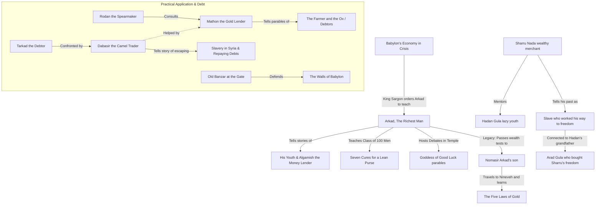

# Story Map: The Richest Man in Babylon

George S. Clason’s classic is not a linear novel, but rather a collection of nested parables set in ancient Babylon. The structure can feel scattered because stories are told *within* stories, often jumping between different eras and characters. 

This map visualizes the structural flow, character relationships, and core themes to help readers (and listeners) navigate the book.

---

## 🗺️ Narrative Structure Overview

The book moves from the **present day of Babylon's peak** (under King Sargon) to **nested flashbacks** (Arkad's youth), then to **descendants/future generations** (Arkad's son Nomasir and later merchants), showing how the financial laws are passed down.

---

## 👥 Key Character Matrix

| Character | Role / Occupation | Core Contribution | Connection |
| :--- | :--- | :--- | :--- |
| **Arkad** | The Richest Man in Babylon | The central teacher of the book. | Mentored by Algamish; father of Nomasir; teacher to Bansir & Kobbi. |
| **Algamish** | Wealthy Money Lender | Arkad's mentor. | Taught Arkad the first laws of money in exchange for fast copying work. |
| **Bansir & Kobbi** | Chariot Builder & Musician | The "everymen" who trigger Arkad's teachings. | Arkad's childhood friends who realize they are still poor despite hard work. |
| **Nomasir** | Arkad's Son | Proves the laws of gold in the real world. | Tasked by Arkad to prove he can manage money before inheriting the estate. |
| **Dabasir** | Camel Trader | Escaped slavery in Syria; teaches debt repayment. | Mentors Tarkad; tells the story of escaping slavery with the help of Sira. |
| **Mathon** | Gold Lender of Babylon | The expert on risk, debt, and security. | Advises Rodan the spearmaker on whether to lend gold. |
| **Rodan** | Royal Spearmaker | The "newly rich" everyman. | Received 50 gold pieces from the King and seeks Mathon's advice. |
| **Sharru Nada** | Wealthy Merchant | Shows the value of hard work and humility. | Friend/partner of Arad Gula; mentors Arad's spoiled grandson, Hadan Gula. |

---

## 📖 Chapter-by-Chapter Map & Lessons

### 1. The Man Who Desired Gold
*   **Characters:** Bansir (chariot builder), Kobbi (musician).
*   **Plot:** Bansir is depressed because he works hard but has no savings. Kobbi points out they are living hand-to-mouth. They decide to visit their childhood friend Arkad, who has become fabulously wealthy, to ask how he did it.
*   **Lesson:** Hard work alone does not make you rich; you must seek the *wisdom* of wealth building.

### 2. The Richest Man in Babylon
*   **Characters:** Arkad, Bansir, Kobbi, Algamish (money lender).
*   **Plot:** Arkad explains that he was a simple scribe who bargained with the lender Algamish for financial wisdom. Algamish gave him the secret: *"A part of all you earn is yours to keep."* Arkad details his early failures (investing in jewels through a brickmaker) and eventual successes.
*   **Lesson:** Pay yourself first (at least 10%). Seek advice only from those competent to give it.

### 3. Seven Cures for a Lean Purse
*   **Characters:** Arkad, King Sargon, 100 citizens.
*   **Plot:** King Sargon realizes Babylon is poor because a few men hold all the wealth. He orders Arkad to teach 100 men in the Temple of Learning so they can teach the rest of the city.
*   **Lessons (The 7 Cures):**
    1. Start thy purse to fattening (Save 10%).
    2. Control thy expenditures (Don't confuse desires with necessities).
    3. Make thy gold multiply (Invest wisely).
    4. Guard thy treasures from loss (Avoid high-risk investments).
    5. Make of thy dwelling a profitable investment (Own your home).
    6. Ensure a future income (Prepare for retirement/family security).
    7. Increase thy ability to earn (Improve your skills).

### 4. Meet the Goddess of Good Luck
*   **Characters:** Arkad, Citizens in the Temple.
*   **Plot:** A debate takes place in the Temple about how to attract good luck. Arkad explains that "luck" is actually **opportunity met with action**. He tells stories of a merchant who hesitated to buy a herd of sheep and lost a great deal, showing that procrastinators drive away luck.
*   **Lesson:** Good luck flees from procrastination and embraces those who take prompt action when opportunity knocks.

### 5. The Five Laws of Gold
*   **Characters:** Nomasir (Arkad's son), Arkad (via flashback/tablet).
*   **Plot:** To inherit Arkad's estate, Nomasir had to prove himself. Arkad gave him one bag of gold and a clay tablet outlining the *Five Laws of Gold*. Nomasir initially loses the gold to scammers but recovers his fortune by strictly applying the laws written on the tablet.
*   **Lessons (The 5 Laws):**
    1. Gold comes to those who save at least 1/10th.
    2. Gold works diligently for those who find it profitable employment.
    3. Gold clings to the cautious owner who invests under wise advice.
    4. Gold slips away from those who invest in things they do not understand.
    5. Gold flees from those who seek impossible earnings or follow scammers.

### 6. The Gold Lender of Babylon
*   **Characters:** Rodan (spearmaker), Mathon (gold lender).
*   **Plot:** Rodan wins 50 gold pieces and wants to lend it to his sister's husband. Mathon advises him against it by sharing stories of other borrowers, including a farmer who learned the language of beasts and ended up doing the ox's hard labor. 
*   **Lesson:** Do not help others in a way that places their burdens onto your own shoulders. Prevent regret before lending.

### 7. The Walls of Babylon
*   **Characters:** Old Banzar (soldier), Citizens of Babylon.
*   **Plot:** While the king is away at war, Babylon is besieged. Terrified citizens ask Banzar at the gates if they will survive. He reassures them that the walls are strong. The city holds out for weeks and eventually wins.
*   **Lesson:** We all need walls of protection (insurance, savings, investments) to guard against unexpected life crises.

### 8. The Camel Trader & The Luckiest Man in Babylon (Combined in Chapter 11)
*   **Characters:** Dabasir (camel trader), Tarkad (debtor), Sharru Nada (merchant), Hadan Gula (cynical youth), Arad Gula (ancestor, slave).
*   **Plot:** This section contains two major story lines that have been merged in the current file structure:
    1. **Dabasir's Escape:** Dabasir meets Tarkad (who owes him money) and tells him how he ended up in debt, ran away to Syria, became a slave, and was inspired by his master's wife (Sira) to prove he had "the soul of a free man." He escaped across the desert back to Babylon to repay all his debts.
    2. **Sharru Nada's Mentorship:** Sharru Nada mentors Hadan Gula by sharing how he was sold into slavery because of his brother's actions, but survived and built a fortune through the honor of work alongside Hadan's grandfather, Arad Gula.
*   **Lesson:** Where the determination is, the way can be found. Work is the best friend a person can have.

---

## 💡 How this Map Guides the Adaptation
When presenting this book to modernized readers:
1. **Highlight the "Framing Narratives":** Let readers know that *The Man Who Desired Gold* is the setup for the rest of the book's main teachings.
2. **Clarify Chapter 5 (Nomasir):** Emphasize that this is the only chapter set outside Babylon (in Nineveh) to show that the laws of wealth work everywhere.
3. **Use Character Continuity:** Connect Banzar (the chariot builder in Chapter 1) to Banzar (the gate guard in Chapter 7) so readers spot the recurring "everyman" archetype.
