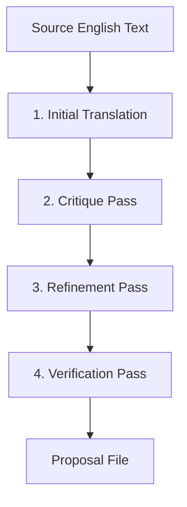

# 📖 Literary Translation & Editing Workflow Guide

This guide establishes the standardized agentic workflow for translating, refining, and editing literary works within the book production pipeline. Adhering to this workflow ensures high-quality, natural, and context-aware translations (e.g., English to Korean) optimized for both human reading and Text-to-Speech (TTS) narration.

---

## 1. Model Selection Guidance

Translation quality is highly dependent on the model's linguistic reasoning capacity. Selecting the correct model tier is critical:

*   **High-Tier Reasoning Models (e.g., Gemini 1.5 Pro)**:
    *   **Usage**: Must be used for all translation, editing, and refinement passes.
    *   **Why**: These models excel at understanding literary subtext, tracking complex character relationships (kinship terms), adapting idiomatic proverbs, and maintaining consistent stylistic tone across paragraphs.
*   **Lightweight Models (e.g., Gemini 2.5 Flash)**:
    *   **Usage**: Restrict to simple automated utility tasks (such as parsing text files into JSON segments, format checks, or basic audits).
    *   **Why**: Flash models tend to translate literally (creating stiff "번역투" prose) and often apply guidelines mechanically, leading to contextual errors.

### 💡 API Key Bypassing via Subagents
*   **Workflow Standard**: Avoid running direct Python translation scripts (`translate_en_to_ko.py`) that require a personal developer Gemini API key inside WSL/terminal. Running direct API calls can rapidly exhaust daily developer quota limits or run into credit limits.
*   **Subagent Approach**: Spawn **specialized subagents** (`define_subagent` / `invoke_subagent`) to perform the translation and critique passes. Since subagents run within their own sandboxed contexts inheriting the parent's full model capacity, they do not require developers to manage personal API keys or incur personal rate limits, allowing seamless, highly-parallelized literary processing.

---

## 2. The Multi-Step Agentic Translation Loop

To avoid the quality issues of single-pass machine translation, agents must execute a structured, multi-step self-correction loop:

### Step 1: Initial Translation
Translate the source text paragraph-by-paragraph using the base translation prompt rules (e.g., character casting, name mappings, and styling requirements).

### Step 2: Critique Pass
Analyze the initial draft against the following critical checks:
1.  **Awkward Phrasing**: Scan for mechanical sentence structures and literal translations that read unnaturally in the target language.
2.  **Kinship & Relationship Context**: Verify that honorifics, relationship terms, and familial pronouns are correct from the perspective of both the speaker and the subject.
3.  **Proverbs & Idioms**: Identify direct translations of cultural proverbs. Replace them with natural, culturally appropriate literary adaptations.
4.  **Mythological Accuracy**: Ensure specialized terms or names are translated correctly (e.g., Atlas is a Titan/deity, not a wizard).

### Step 3: Refinement Pass
Re-write the translation based on the critique, upgrading the prose to polished, elegant, classic novelistic prose (such as a natural 하십시오체/해라체 mix in Korean).

### Step 4: Verification Pass
Cross-check that the paragraph count, structure, and XML dialogue tags are preserved exactly, line-for-line, compared to the source file.

---

## 3. Context-Aware Kinship & Idiom Mapping

Never translate kinship terms or proverbs word-for-word. Apply these context rules:

### Contextual Kinship
*   *Rule*: Translate relationships based on the social setting rather than just the literal words in the prompt rules.
*   *Example (Odyssey Chapter 1)*: When Telemachus is advised to send his mother Penelope back to her father's house, a rigid application of the rules resulted in *"send your mother to maternal grandfather's house; maternal grandfather will find her a husband"*. 
*   *Correction*: Translate Penelope's return using the maiden-home relationship context: **"친정"** (maiden home) and **"친정 식구들 / 친정 아버지"** (maiden family/father), which is the standard, natural Korean equivalent.

### Cultural Proverbs
*   *Rule*: Adapt foreign proverbs into native literary metaphors rather than translating them literally.
*   *Example (Odyssey Chapter 1)*:
    *   *English*: *"It is a wise child that knows his own father."*
    *   *Awkward Literal*: "자기 아버지를 아는 자식은 현명한 자식이라고들 합니다."
    *   *Refined Literary*: "실상 자기가 누구의 피줄인지 스스로 온전히 아는 자식은 없다고들 하지요." (None can truly prove their own lineage).

---

## 4. Human-in-the-Loop Verification

To maintain codebase and text integrity, translations must go through a review phase before modifying the main project files:

1.  **Output to Proposal File**: Write the subagent's refined translation to a temporary proposal file (e.g., `chapters/tagged/tagged_ch_XX_ko_proposal.txt`).
2.  **Comparison Report**: Generate a side-by-side comparison table of key diffs (comparing the original English, old Korean, and new proposed Korean).
3.  **Approval Checklist**: Check line-for-line alignment, name consistency, and XML tag balance.
4.  **Overwrite after Approval**: Only overwrite the project chapter file after explicit user approval is received.

---

## 5. Concurrent Chapter Loop Execution

For full-book translation projects containing many chapters (e.g., 24 chapters), processing them sequentially is inefficient. The standard workflow uses a **Concurrent Chapter Loop**:

1.  **Dynamic Controller Prompts**: The parent agent dynamically generates the translation prompts for each chapter, specifying the chapter number (e.g., `ch_01` to `ch_24`), input paths, output paths, and context-specific casting constraints.
2.  **Parallel Spawn**: The parent agent invokes all subagents concurrently in a single batch (or using a programmatic command loop) to translate all chapters in parallel.
3.  **Central Task Monitoring**: Maintain a central checklist in `task.md` to track each subagent's progress (e.g., `[/]` in progress, `[x]` completed).
4.  **Batch Proposal Review**: As subagents finish, they write their proposals to temporary proposal files. The parent agent gathers the results, presents key comparison diffs in batches, and overwrites the main files upon approval.
5.  **State-Based Resumption (Skip Checks)**: To handle unexpected disconnections (e.g., server restarts or timeouts), the controller loop must perform a state check on disk. If the proposal file (or final tagged file) for a chapter already exists and is non-empty, the controller skips spawning a subagent for that chapter, allowing the workflow to resume from where it was interrupted.
6.  **Debug-Friendly Workspace Retention**: Keep the subagents' scratch directories and intermediate files intact. If a subagent crashes or fails, its specific workspace context, logs, and trace scripts must be preserved to allow direct debugging and diagnosis.

